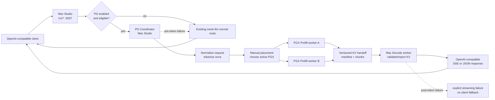

# Phase 3 架构审阅指南

生成日期：2026-05-19  
适用范围：`PD-detach` Phase 3 目标架构审阅  
阅读对象：项目负责人、技术负责人、范围决策人  

本文是 10 分钟审阅摘要，用来帮助判断 Phase 3 架构设计是否可以进入 OpenSpec propose。它不替代 Phase 3 的完整设计文档，也不面向实现工程师展开实现细节。

## 1. 目标架构一句话

在现有 mesh-llm 架构内新增一条默认关闭、手动开启、可回退、可观测的 PD execution lane：Mac Studio 同时承担 OpenAI-compatible ingress、Coordinator 和 Decode worker，两台 PGX 作为 Prefill worker 候选，PGX 完成 prompt/prefill 后把 KV 或等价 decode state 交给 Mac 继续 token-by-token decode。  
证据：`docs/PD-detach/phase-3/TARGET_ARCHITECTURE.zh.md`、`docs/PD-detach/phase-3/ROLE_AND_SCHEDULING.zh.md`、`docs/PD-detach/phase-3/DEPLOYMENT_TOPOLOGY.zh.md`

当前阶段结论是 **Conditional Go**：Phase 3 架构材料足够进入 OpenSpec propose，但第一份 OpenSpec change 建议命名为 `pd-kv-handoff-spike`，先验证 PGX 到 Mac 的 KV handoff，再推进完整 MVP 实现。  
证据：`docs/PD-detach/phase-3/PHASE_3_EXIT_REVIEW.zh.md`、`docs/PD-detach/phase-3/KV_HANDOFF_DESIGN.zh.md`、`docs/PD-detach/phase-3/VALIDATION_PLAN.zh.md`

## 2. 整体流程图

这张图表达三个负责人需要拍板的事实：外部 API 不变，PD 是内部执行路径；MVP 不做自动调度，只做手动 placement；首 token 前可回退 normal mesh path，首 token 后不能透明回退。  
证据：`docs/PD-detach/phase-3/PD_DATA_FLOW.zh.md`、`docs/PD-detach/phase-3/API_AND_PROTOCOL.zh.md`、`docs/PD-detach/phase-3/ROLE_AND_SCHEDULING.zh.md`

## 3. 4 个 ADR 的决策

| ADR | 已做决策 | 对项目负责人的含义 | 证据 |
|---|---|---|---|
| ADR-001 集中式 Coordinator | MVP 采用集中式 Coordinator，推荐 Mac Studio 同时承担 Coordinator 和 Decode worker，PGX 不直接面对外部客户端。 | 第一版控制面简单、fallback 可控；后续多 decode worker 或多请求并发需要再扩展。 | `docs/PD-detach/phase-3/ADR/ADR-001-centralized-coordinator.zh.md` |
| ADR-002 KV handoff MVP | MVP 以 Native KV Page Handoff 为目标，但必须先 spike；如果 PGX->Mac import 或正确性失败，不能直接做完整 MVP。 | 第一份 OpenSpec 建议为 `pd-kv-handoff-spike`，先验证 KV handoff，而不是承诺完整功能上线。 | `docs/PD-detach/phase-3/ADR/ADR-002-kv-handoff-mvp.zh.md`、`docs/PD-detach/phase-3/KV_HANDOFF_DESIGN.zh.md` |
| ADR-003 Skippy 复用边界 | 复用 Skippy 的 runtime、protocol、status、KV manifest/identity/export/import 经验，但不把现有按层 split serving 当作 PD MVP。 | 可以利用现有资产降低风险，但不能把“按层切分”误认为“Prefill/Decode 分离”。 | `docs/PD-detach/phase-3/ADR/ADR-003-skippy-reuse.zh.md` |
| ADR-004 外部 API 兼容 | 外部仍保持 OpenAI-compatible API，不新增必需 PD endpoint，不替换 `/v1/*`，status 只做 additive 扩展。 | 客户端迁移成本低；PD 可以灰度、关闭和回退；内部复杂度由 Coordinator 承担。 | `docs/PD-detach/phase-3/ADR/ADR-004-external-api-compatibility.zh.md`、`docs/PD-detach/phase-3/API_AND_PROTOCOL.zh.md` |

## 4. 最关键的 5 个技术风险

| 风险 | 为什么关键 | 项目负责人要看的结果 | 证据 |
|---|---|---|---|
| PGX CUDA/runtime 导出的 KV 能否被 Mac Metal/runtime 导入并继续 decode 尚未验证 | 这是 PD MVP 成败的核心；如果不可行，目标架构需要回退到替代方案。 | 先创建 `pd-kv-handoff-spike`，以跨机器正确性作为进入完整 MVP 的门槛。 | `docs/PD-detach/phase-3/KV_HANDOFF_DESIGN.zh.md`、`docs/PD-detach/phase-3/PHASE_3_EXIT_REVIEW.zh.md` |
| KV payload 大小和网络耗时可能抵消 prefill 收益 | Prompt 越长 KV 越大，handoff 可能成为新的 TTFT 瓶颈。 | 必须实测 `kv_handoff_bytes`、export/transfer/import 耗时和 TTFT baseline。 | `docs/PD-detach/phase-3/KV_HANDOFF_DESIGN.zh.md`、`docs/PD-detach/phase-3/VALIDATION_PLAN.zh.md` |
| 模型、tokenizer、chat template、position/runtime ABI 不一致会造成错误输出 | KV 是 decode 状态，不是普通文本；任何 identity mismatch 都可能产生看似正常但实际错误的 token。 | OpenSpec 前要定义 artifact identity/hash 与 tokenizer/chat template identity/hash；mismatch 必须 fail closed。 | `docs/PD-detach/phase-3/KV_HANDOFF_DESIGN.zh.md`、`docs/PD-detach/phase-3/PD_DATA_FLOW.zh.md` |
| Skippy 可复用但语义不同，容易产生范围误判 | Skippy 现有 split serving 是 layer/activation chain，PD 目标是 prefill 后 Mac 独立 decode。 | OpenSpec 中要明确复用哪些 Skippy 基础设施、哪些路径不算 PD MVP。 | `docs/PD-detach/phase-3/ADR/ADR-003-skippy-reuse.zh.md`、`docs/PD-detach/phase-3/API_AND_PROTOCOL.zh.md` |
| fallback 与安全边界必须清楚 | 首 token 后不能静默切换 normal path；KV、prompt、token array、credentials 不能进日志或 telemetry。 | MVP 推荐首 token 后终止 SSE 并返回明确 error/partial 结束状态，保留安全审计项。 | `docs/PD-detach/phase-3/PD_DATA_FLOW.zh.md`、`docs/PD-detach/phase-3/API_AND_PROTOCOL.zh.md`、`docs/PD-detach/phase-3/VALIDATION_PLAN.zh.md` |

## 5. MVP 到底怎么跑通

| 步骤 | MVP 行为 | 证据 |
|---|---|---|
| 1. 正常入口 | 客户端仍调用 Mac Studio 的 OpenAI-compatible `/v1/*`，不需要知道 PGX 节点。 | `docs/PD-detach/phase-3/API_AND_PROTOCOL.zh.md`、`docs/PD-detach/phase-3/DEPLOYMENT_TOPOLOGY.zh.md` |
| 2. 显式启用 | PD 默认关闭；只在手动开启、手动 placement、模型和 worker 兼容时进入 PD lane。 | `docs/PD-detach/phase-3/ROLE_AND_SCHEDULING.zh.md`、`docs/PD-detach/phase-3/PD_DATA_FLOW.zh.md` |
| 3. Coordinator 接管请求生命周期 | Mac Studio 负责 admission、request normalization、tokenization、worker 选择、fallback 和 streaming ownership。 | `docs/PD-detach/phase-3/TARGET_ARCHITECTURE.zh.md`、`docs/PD-detach/phase-3/ADR/ADR-001-centralized-coordinator.zh.md` |
| 4. PGX 做 prefill | Coordinator 选择一个 active PGX，PGX 使用 token IDs 做 prefill，并导出 KV 或等价 decode state。 | `docs/PD-detach/phase-3/PD_DATA_FLOW.zh.md`、`docs/PD-detach/phase-3/ROLE_AND_SCHEDULING.zh.md` |
| 5. Mac 做 decode | Mac 校验 manifest，导入 KV，继续 token-by-token decode，并由 Coordinator 适配成 OpenAI-compatible 响应。 | `docs/PD-detach/phase-3/KV_HANDOFF_DESIGN.zh.md`、`docs/PD-detach/phase-3/API_AND_PROTOCOL.zh.md` |
| 6. 失败处理 | 首 token 前 PD 失败回退 normal mesh path；首 token 后失败必须明确终止或返回 streaming error，不能透明回退。 | `docs/PD-detach/phase-3/PD_DATA_FLOW.zh.md`、`docs/PD-detach/phase-3/API_AND_PROTOCOL.zh.md` |
| 7. 验收口径 | MVP 先证明功能打通、单用户可用、baseline 可测量；多并发、自动 placement、KV 压缩和低精度量化不进第一版。 | `docs/PD-detach/phase-3/VALIDATION_PLAN.zh.md`、`docs/PD-detach/phase-3/PHASE_3_EXIT_REVIEW.zh.md` |

## 6. 进入 OpenSpec 前必须确认

| 必须确认项 | 为什么必须先确认 | 证据 |
|---|---|---|
| 第一份 OpenSpec change | 推荐创建 `pd-kv-handoff-spike`，不直接创建完整 MVP implementation。 | `docs/PD-detach/phase-3/PHASE_3_EXIT_REVIEW.zh.md`、`docs/PD-detach/phase-3/VALIDATION_PLAN.zh.md` |
| 内部协议边界 | 逻辑上定义 `pd-handoff/1`；spike 阶段可复用 Skippy transport / KV 代码。 | `docs/PD-detach/phase-3/API_AND_PROTOCOL.zh.md`、`docs/PD-detach/phase-3/ADR/ADR-003-skippy-reuse.zh.md` |
| artifact identity/hash 的最小规则 | 模型文件内容 `sha256` 必须一致，模型名或路径不能单独作为一致性依据。 | `docs/PD-detach/phase-3/KV_HANDOFF_DESIGN.zh.md`、`docs/PD-detach/phase-3/DEPLOYMENT_TOPOLOGY.zh.md` |
| tokenizer/chat template identity/hash 的最小规则 | GGUF tokenizer metadata hash + `tokenizer.chat_template` hash；Coordinator 统一 tokenization。 | `docs/PD-detach/phase-3/PD_DATA_FLOW.zh.md`、`docs/PD-detach/phase-3/KV_HANDOFF_DESIGN.zh.md` |
| native KV export/import spike 的最小通过标准 | 固定 prompt、deterministic decode、PGX prefill -> Mac import -> baseline 可解释一致，并记录 KV bytes/latency。 | `docs/PD-detach/phase-3/VALIDATION_PLAN.zh.md`、`docs/PD-detach/phase-3/KV_HANDOFF_DESIGN.zh.md` |
| post-token streaming failure policy | 首 token 后终止 SSE 并返回明确 error/partial 结束状态，不透明 fallback。 | `docs/PD-detach/phase-3/PD_DATA_FLOW.zh.md`、`docs/PD-detach/phase-3/API_AND_PROTOCOL.zh.md` |

## 7. 建议的负责人审阅结论

建议以 **Conditional Go** 通过 Phase 3，并要求下一步 OpenSpec 创建 `pd-kv-handoff-spike`，聚焦 KV handoff spike、PD enable/placement、worker capability/status、Coordinator lifecycle、fallback/safety 和 baseline validation。  
证据：`docs/PD-detach/phase-3/PHASE_3_EXIT_REVIEW.zh.md`、`docs/PD-detach/phase-3/VALIDATION_PLAN.zh.md`

不建议第一份 OpenSpec 同时承诺多 decode workers、多 request 并发、自动 placement、KV 压缩/增量传输、公共 mesh 跨 owner PD 或低精度 quantization。  
证据：`docs/PD-detach/phase-3/PHASE_3_EXIT_REVIEW.zh.md`、`docs/PD-detach/phase-3/ROLE_AND_SCHEDULING.zh.md`
