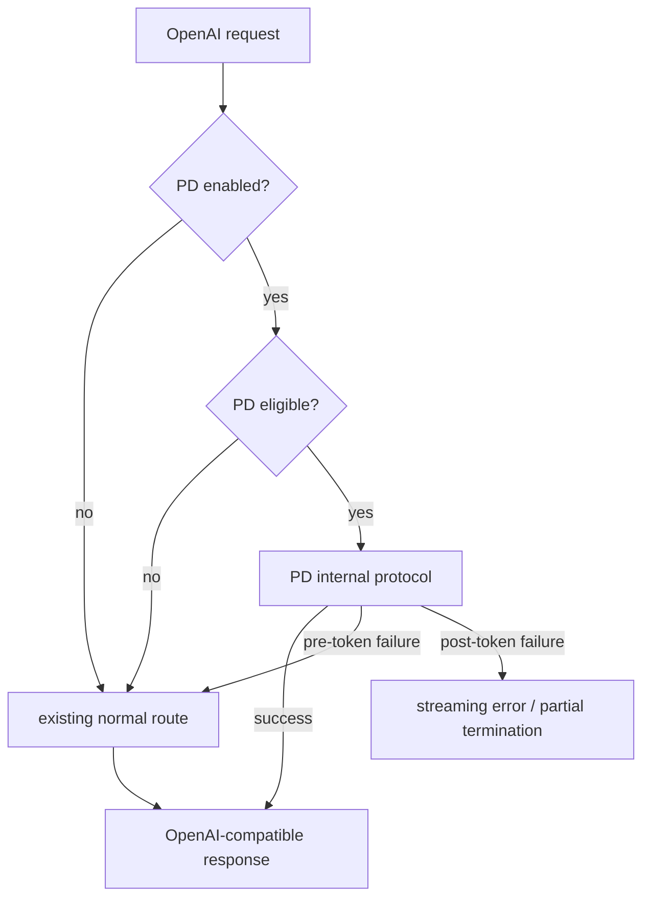
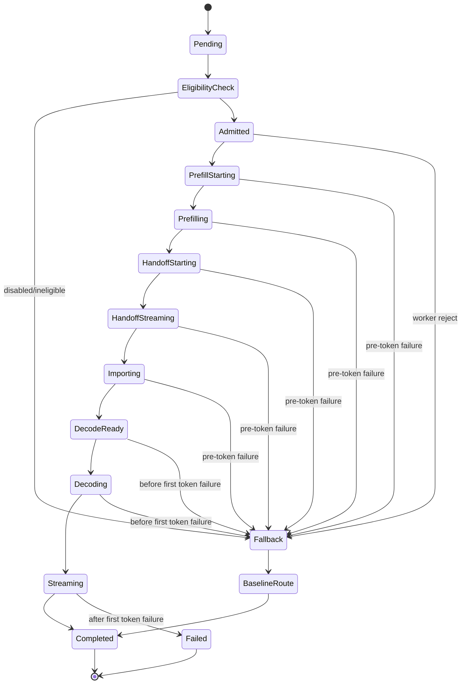

# API 与协议设计

文档状态：Phase 3 目标架构设计  
生成日期：2026-05-19  
适用范围：`PD-detach` 大型二开  

本文设计 PD 分离对外 API 兼容、内部协议、错误码、状态机和版本兼容。本文不实现代码。

## 1. 外部 API 保持方式

外部客户端继续使用现有 OpenAI-compatible surface：

| Surface | 保持方式 | 证据 |
|---|---|---|
| `/v1/*` | 不换 endpoint；PD 是内部 execution lane。 | `crates/mesh-llm-host-runtime/src/api/routes/chat.rs`、`network/openai/ingress.rs` |
| `/models` | 模型列表语义不因 PD 破坏。 | `docs/PD-detach/phase-1/API_REFERENCE.md` |
| `/api/chat*` | 继续 rewrite 到 `/v1/chat/completions`。 | `crates/mesh-llm-host-runtime/src/api/routes/chat.rs` |
| `/api/responses*` | 继续 rewrite 到 `/v1/responses`。 | `crates/mesh-llm-host-runtime/src/api/routes/chat.rs` |
| `/api/status` | 可增加 additive PD status，不破坏现有字段。 | `crates/mesh-llm-host-runtime/src/api/status.rs` |
| `/api/runtime/stages` | 可复用/补充 runtime stage 和 PD worker 状态。 | `crates/mesh-llm-host-runtime/src/api/mod.rs` |
| `/api/events` | 可输出 sanitized PD lifecycle events。 | `docs/PD-detach/phase-1/API_REFERENCE.md` |

禁止：

- 替换 `/v1/*`。
- 要求调用方使用新的 PD endpoint 才能获得 OpenAI-compatible 行为。
- 默认开启 PD。
- 在错误响应中泄露 prompt、token array、KV payload、credentials、私有路径。

## 2. 外部行为



客户端可见结果：

- 成功：与普通 OpenAI-compatible 响应一致。
- 首 token 前 PD 失败：客户端看到 normal mesh path 的响应。
- 首 token 后失败：MVP 推荐终止 SSE，并返回明确 error/partial 结束状态；不能静默切换 normal path。

## 3. 内部协议边界

### 3.1 mesh protocol

当前正式 mesh protocol 是 `mesh-llm/1`，现有 protobuf gossip 必须 additive。`mesh-llm/0` 不作为当前正式运行协议扩展目标。

证据：

- `crates/mesh-llm-protocol/src/protocol/mod.rs`
- `crates/mesh-llm-protocol/proto/node.proto`
- `docs/PD-detach/phase-1/PROTOCOL_COMPATIBILITY.md`

### 3.2 Skippy protocol

Skippy 已有：

- `STAGE_ALPN_V1 = skippy-stage/1`
- `STAGE_SUBPROTOCOL_NAME = skippy-stage`
- `STAGE_PROTOCOL_GENERATION = 2`
- stage control / transport / artifact transfer streams
- binary message kinds including `StateImport` and `StateExport`

证据：`crates/skippy-protocol/src/lib.rs`、`crates/skippy-protocol/proto/stage.proto`、`crates/skippy-protocol/src/binary/types.rs`。

### 3.3 推荐 PD 内部协议

推荐把 PD handoff 定义为独立内部协议 `pd-handoff/1`。

这里的 subprotocol 指 mesh-llm 节点之间使用的内部通信协议，不是外部用户调用的 HTTP API。外部用户仍调用 `/v1/*`；`pd-handoff/1` 只用于 Mac/PGX 节点之间传控制消息、manifest、KV chunks 和 lifecycle 状态。

负责人拍板版建议：

- 目标协议边界：`pd-handoff/1`。
- 第一份 OpenSpec change：`pd-kv-handoff-spike`。
- spike 阶段允许复用 Skippy stage transport、KV manifest、export/import 相关代码来快速验证。
- 不建议把 PD 语义永久混进 `skippy-stage/1`，因为 Skippy 是 layer/activation split，PD 是 prefill/decode split。

理由：

- PD 语义是 prefill/decode role split，不等于 Skippy layer stage split。
- 独立协议能明确 KV handoff manifest、worker roles、fallback reason 和 request lifecycle。
- 仍可复用 Skippy KV manifest、runtime export/import、transport framing思想。

## 4. 内部消息草案

以下是架构级消息草案，不是最终 protobuf schema。

### 4.1 Control messages

| Message | 方向 | 作用 |
|---|---|---|
| `PdCapabilityAdvertise` | worker -> mesh/status | 声明角色、模型、tokenizer、KV format、backend、capacity。 |
| `PdPrefillStart` | coordinator -> prefill | 开始 prefill，携带 token IDs 和 metadata。 |
| `PdPrefillAccepted` | prefill -> coordinator | prefill worker 接受请求。 |
| `PdPrefillRejected` | prefill -> coordinator | 拒绝并给出 sanitized reason。 |
| `PdPrefillComplete` | prefill -> coordinator | prefill 完成，准备 handoff。 |
| `PdDecodePrepare` | coordinator -> decode | 准备接收 KV handoff。 |
| `PdDecodeReady` | decode -> coordinator | KV 导入完成，可以 decode。 |
| `PdAbort` | coordinator -> worker | 请求取消、fallback 或 cleanup。 |
| `PdStatus` | worker -> coordinator/status | 当前 PD worker 状态。 |

### 4.2 KV data messages

| Message | 方向 | 作用 |
|---|---|---|
| `PdKvManifest` | prefill -> decode | 声明 KV 格式、identity、bytes、checksum。 |
| `PdKvAccept` | decode -> prefill | manifest 校验通过，允许发送 chunks。 |
| `PdKvReject` | decode -> prefill | manifest 校验失败。 |
| `PdKvChunk` | prefill -> decode | 分块传输 KV payload。 |
| `PdKvCommit` | prefill -> decode | 完整 payload 发送完成。 |
| `PdKvImported` | decode -> coordinator | import 成功。 |

### 4.3 Decode messages

MVP 可以由 decode worker 内部持续 decode，不一定需要每 token 一个远程 control message。如果需要显式 control：

| Message | 方向 | 作用 |
|---|---|---|
| `PdDecodeStart` | coordinator -> decode | 开始 token generation。 |
| `PdToken` | decode -> coordinator | 返回一个或多个 token。 |
| `PdDecodeComplete` | decode -> coordinator | 完成。 |
| `PdDecodeError` | decode -> coordinator | 失败。 |

## 5. 状态机



## 6. 错误码设计

### 6.1 内部 PD error kind

| Error kind | 可 fallback | 说明 |
|---|---:|---|
| `pd_disabled` | 是 | PD 未开启。 |
| `pd_not_eligible` | 是 | 模型/请求不满足 PD 条件。 |
| `pd_busy` | 是 | 单请求 MVP 已有 in-flight。 |
| `prefill_worker_unavailable` | 是 | 无可用 PGX worker。 |
| `decode_worker_unavailable` | 是 | Mac decode worker 不可用。 |
| `model_mismatch` | 是 | model artifact identity 不匹配。 |
| `tokenizer_mismatch` | 是 | tokenizer/chat template 不匹配。 |
| `kv_format_mismatch` | 是 | KV version/layout/dtype/ABI 不匹配。 |
| `kv_export_failed` | 是 | PGX export 失败。 |
| `kv_transfer_timeout` | 是 | Handoff 超时。 |
| `kv_checksum_mismatch` | 是 | payload 校验失败。 |
| `kv_import_failed` | 是 | Mac import 失败。 |
| `decode_failed_before_token` | 是 | 首 token 前 decode 失败。 |
| `decode_failed_after_token` | 否 | 已 streaming，不能透明 fallback。 |
| `request_cancelled` | 否 | 客户端取消，清理。 |

### 6.2 外部 HTTP/SSE 映射

| 内部结果 | 外部行为 |
|---|---|
| PD success | 正常 OpenAI-compatible response。 |
| Pre-token fallback success | 正常 OpenAI-compatible response，内部 status 记录 fallback。 |
| Pre-token fallback also failed | 当前 normal route 的错误响应。 |
| Post-token failure | MVP 推荐终止 SSE，并返回明确 error/partial 结束状态；不能伪装为成功，不能透明 fallback。 |
| Invalid client request | 保持现有 4xx 行为。 |

## 7. Version compatibility

PD protocol 版本策略：

- `pd-handoff/1` 作为内部 capability major version。
- KV manifest 包含 `schema_version` 和 `kv_format_version`。
- Handoff payload 不兼容时 fail closed。
- 新字段 additive。
- 旧节点未声明 PD capability 时不参与 PD。
- 低于 `v0.60.0` 且可解析版本的节点不参与 PD。

mesh compatibility 策略：

- 不改变 `mesh-llm/1` 现有字段语义。
- 不扩大 `mesh-llm/0` 支持。
- 如果要新增 gossip capability 字段，必须 additive，并说明旧节点忽略后的行为。

## 8. API status 扩展建议

未来 OpenSpec 可考虑 additive status：

```json
{
  "pd": {
    "enabled": false,
    "mode": "manual",
    "coordinator": "self",
    "decode_worker": "macstudio",
    "prefill_workers": [
      { "name": "pgx-a", "state": "ready", "capacity": "idle" }
    ],
    "active_request": null,
    "last_fallback_reason": "kv_import_failed",
    "last_handoff_bytes": 0,
    "last_handoff_ms": 0
  }
}
```

要求：

- 只展示 sanitized 信息。
- 不展示 token IDs、prompt、KV bytes 内容、credential、私有路径。
- 字段 additive，不破坏现有 UI adapter。

## 9. OpenSpec 输入建议

OpenSpec propose 阶段建议先创建：

```text
pd-kv-handoff-spike
```

该 change 不承诺完整 PD MVP，而是先回答 PGX KV / decode state 是否能被 Mac 正确接管。

后续完整 MVP proposal 再把协议拆成至少三个合同：

1. `PD activation/placement config contract`
2. `PD worker capability/status contract`
3. `PD KV handoff protocol contract`

其中第 3 项必须以 `pd-kv-handoff-spike` 结果作为前置输入。

## 10. OpenSpec 前的推荐决策

| 事项 | 推荐决策 |
|---|---|
| 第一份 OpenSpec change | `pd-kv-handoff-spike`，不是完整 MVP implementation。 |
| 内部协议边界 | 逻辑上定义 `pd-handoff/1`；spike 可复用 Skippy transport / KV 代码。 |
| 外部 API | 保持 `/v1/*` OpenAI-compatible，不新增必需 PD endpoint。 |
| 首 token 前失败 | fallback normal mesh path。 |
| 首 token 后失败 | 明确 SSE error/partial termination，不透明 fallback。 |
| 敏感数据 | 不在错误响应、status、events、telemetry 中泄露 prompt、token array、KV payload、credentials、私有路径。 |
