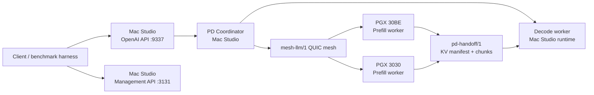

# 部署拓扑设计

文档状态：Phase 3 目标架构设计  
生成日期：2026-05-19  
适用范围：`PD-detach` 大型二开  

本文描述两台 PGX + 一台 Mac Studio 的目标部署拓扑、进程角色、端口、模型路径变量、配置原则、启动/停止/回滚原则。本文不启动远端部署，不修改配置默认值。

## 1. 拓扑目标



目标部署：

- Mac Studio：Coordinator + Decode worker + external OpenAI-compatible ingress。
- PGX 30BE：Prefill worker candidate。
- PGX 3030：Prefill worker candidate。
- 所有节点仍运行 mesh-llm，保留现有 mesh membership、management status 和 normal route fallback。

## 2. 环境来源

测试机器和模型路径由本地文件提供：

```text
<operator-private-env-file>
```

可引用变量名：

| 变量 | 用途 |
|---|---|
| `MESH_MACSTUDIO_NAME` | Mac Studio 节点名。 |
| `MESH_MACSTUDIO_IP` | Mac Studio 地址。 |
| `MESH_MACSTUDIO_USER` | Mac Studio 登录用户。 |
| `MESH_PGX_30BE_NAME` | PGX 30BE 节点名。 |
| `MESH_PGX_30BE_IP` | PGX 30BE 地址。 |
| `MESH_PGX_30BE_USER` | PGX 30BE 登录用户。 |
| `MESH_PGX_3030_NAME` | PGX 3030 节点名。 |
| `MESH_PGX_3030_IP` | PGX 3030 地址。 |
| `MESH_PGX_3030_USER` | PGX 3030 登录用户。 |
| `MESH_GEMMA_MODEL_NAME` | MVP 模型名。 |
| `MESH_GEMMA_MODEL_MAC_PATH` | Mac 上的模型路径。 |
| `MESH_GEMMA_MODEL_PGX_PATH` | PGX 上的模型路径。 |

禁止复制：

- password
- token
- SSH 私钥
- sudo 密码
- 私有连接命令
- 任何不必要的公网/内网细节

证据：`docs/PD-detach/phase-1/SECURITY_AND_PRIVACY.md`、`docs/PD-detach/phase-2/PREFILL_DECODE_REQUIREMENTS.zh.md`。

## 3. 进程角色

| 节点 | mesh-llm 角色 | PD 角色 | 对外暴露 |
|---|---|---|---|
| Mac Studio | mesh peer + API ingress + runtime host | Coordinator + Decode worker | `/v1/*` on `9337`，management `3131` |
| PGX 30BE | mesh peer + runtime host | Prefill worker candidate | 不直接暴露 OpenAI API 给客户端 |
| PGX 3030 | mesh peer + runtime host | Prefill worker candidate | 不直接暴露 OpenAI API 给客户端 |

MVP 不要求客户端知道 PGX 节点。

## 4. 端口与网络

| Surface | 默认/来源 | 用途 | 是否给外部客户端 |
|---|---|---|---|
| OpenAI-compatible API | `9337` | `/v1/*`、`/models` | 是，建议只走 Mac Studio。 |
| Management API / web console | `3131` | `/api/status`、`/api/runtime/stages` 等 | 仅管理/诊断。 |
| mesh QUIC | 当前 mesh runtime 管理 | gossip、routing、subprotocol。 | 不作为 OpenAI API。 |
| Skippy stage transport | runtime/stage config，可能是 ephemeral/local bridge | stage control/transport 候选复用。 | 否。 |
| `pd-handoff/1` | 目标内部协议 | KV manifest/chunks/control。 | 否。 |

注意：

- 本阶段不修改运行默认端口。
- 若后续 OpenSpec 需要新增 PD bind/listen 设置，默认必须关闭或仅内部可达。
- PGX/Mac 之间 KV handoff 应优先走私有 LAN/mesh transport，不通过公共 API。

## 5. 模型路径与 artifact

MVP 模型：

```text
google_gemma-4-31B-it-bf16
```

路径来源：

- Mac：`MESH_GEMMA_MODEL_MAC_PATH`
- PGX：`MESH_GEMMA_MODEL_PGX_PATH`

设计要求：

- 不把本地实际路径值复制进 tracked docs。
- Phase 3/OpenSpec 需要定义 artifact identity/hash，而不是只比较路径字符串。
- Mac 和 PGX 必须证明 artifact 内容一致或兼容。
- Tokenizer 以 GGUF 内嵌 metadata 为权威来源。

## 6. 配置原则

MVP 配置原则：

1. PD 默认关闭。
2. 手动开启。
3. 手动指定 Coordinator、decode worker、prefill workers。
4. 只允许 MVP 模型。
5. 单 request in-flight。
6. 单 decode worker。
7. 只允许已验证 KV format/dtype/backend 组合。

配置入口应该沿用现有配置路径原则：

- CLI `--config <path>`
- `MESH_LLM_CONFIG`
- `~/.mesh-llm/config.toml`

证据：`docs/PD-detach/phase-1/CONFIGURATION.md`、`crates/mesh-llm-host-runtime/src/plugin/config.rs`。

配置形态需等 OpenSpec 决定；本阶段不写实现 schema。

## 7. 启动原则

本阶段不启动部署。目标启动原则如下：

1. 所有节点先以 normal mesh-llm 方式启动，验证普通 mesh 和 `/api/status`。
2. 验证 Mac Studio 能独立加载 MVP 模型并完成 baseline。
3. 验证每台 PGX 能独立加载 MVP 模型并完成 baseline。
4. 开启 PD capability/status 但不接流量。
5. 手动绑定 Mac decode + 单个 PGX prefill。
6. 单请求 smoke。
7. 记录 baseline：Mac-only、PGX-only、normal mesh、PD path。

## 8. 停止原则

停止顺序建议：

1. 停止接收新的 PD request。
2. 等待 in-flight request 完成或取消。
3. 停止 handoff streams。
4. 清理 decode worker 临时 KV/session。
5. 清理 prefill worker 临时 KV/session。
6. 保留 normal mesh-llm 路径。

不得：

- 粗暴删除用户模型 artifact。
- 清理 credentials。
- 删除不属于当前 request/runtime 的用户文件。

## 9. 回滚原则

PD 必须是独立 feature lane，回滚时：

- 关闭 PD enable flag。
- 清空 PD placement。
- 保留 normal mesh-llm API 和 routing。
- 不要求重启所有节点才能恢复 normal path。
- 如 PD runtime 卡死，先停止 PD runtime/session，再使用现有 `mesh-llm stop` / `just stop` 处理节点。

## 10. 部署前检查

进入真实部署前需要确认：

| 检查项 | 目的 |
|---|---|
| 三台机器版本一致且 >= `v0.60.0` | 避免协议/mesh 兼容问题。 |
| 模型 artifact identity 一致 | 避免 KV decode 不一致。 |
| tokenizer identity 一致 | 避免 token 序列不一致。 |
| Mac/PGX KV format capability 一致 | 避免 import 失败或 silent corruption。 |
| PD 默认关闭 | 避免影响 normal path。 |
| fallback 生效 | 保障失败时可回到 normal mesh。 |
| status 可见 | 能诊断 PD worker 和 handoff 失败。 |
| telemetry 不含 prompt/KV | 满足安全边界。 |

## 11. 需要 spike 的部署问题

1. PGX 与 Mac 之间实际网络带宽、RTT、稳定性。
2. KV handoff 是否需要专用 LAN bind/interface。
3. Mac 同时作为 Coordinator + Decode worker 是否会成为 bottleneck。
4. PGX prefill runtime 是否需要常驻 full model，还是可按需加载。
5. PD feature 关闭后是否能完全恢复 normal route，不残留 stage/transport bridge。
