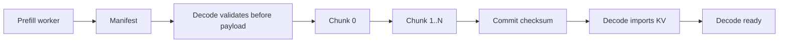

# KV Handoff 设计

文档状态：Phase 3 目标架构设计  
生成日期：2026-05-19  
适用范围：`PD-detach` 大型二开  

本文设计 PGX Prefill worker 到 Mac Studio Decode worker 的 KV cache 交接目标方案。本文不实现代码。

## 1. 关键判断

MVP 的成败取决于一个问题：**PGX runtime 导出的 KV cache 或等价 decode 初始状态，能否被 Mac Studio runtime 校验、导入并继续 decode。**

当前代码已经存在一些可复用基础：

| 能力 | 代码证据 | 说明 |
|---|---|---|
| Skippy binary stage protocol | `crates/skippy-protocol/src/binary/` | 支持 stage message、reply、activation wire dtype、state import/export message kind。 |
| Stage control/status | `crates/skippy-protocol/proto/stage.proto`、`crates/mesh-llm-host-runtime/src/inference/skippy/stage/` | 已有 stage load/status/inventory/transport 概念。 |
| KV manifest | `crates/skippy-server/src/kv_proto.rs` | 已定义 `KvPageManifest`、`PageIdentity`、`PageLayout::LayerContiguous`、`KvCodec::Fp16`。 |
| KV identity | `crates/skippy-server/src/kv_integration/identity.rs`、`crates/skippy-cache/src/identity.rs` | 已把 model、topology、stage、token range、runtime ABI、layout、dtype、ctx 等纳入 hash/identity。 |
| Native state export/import | `crates/skippy-server/src/kv_integration/exact_state.rs` | 已有 `export_kv_page()` / `import_kv_page()`、full state/recurrent state 相关路径。 |

但这些能力还没有证明能完成**跨机器、跨 backend、全模型 prefill 到 decode**的 PD handoff。因此本设计把 KV handoff 标记为 spike-gated。

## 2. 候选方案

| 方案 | 描述 | 优点 | 风险 | MVP 结论 |
|---|---|---|---|---|
| A. Native KV page handoff | PGX prefill 后导出 native KV page bytes + manifest，Mac 校验后导入 decode session。 | 最贴合 PD 目标；decode 不重算 prompt；可复用 Skippy KV manifest/export/import 概念。 | CUDA/Metal/native layout 可能不兼容；实际 bytes 很大；需要 runtime ABI 严格校验。 | 推荐作为 MVP 目标方案，但必须 spike。 |
| B. Full runtime state handoff | 导出完整 runtime/session state，Mac 导入后 decode。 | 可能覆盖 KV 外的隐藏状态。 | 更大、更不透明、更依赖 ABI；跨 backend 风险高。 | 只作为 fallback spike 候选，不建议先选。 |
| C. Skippy activation chain | 复用现有按层 split serving，PGX/Mac 之间传 activation。 | 现有代码更成熟；已有 telemetry/status。 | 不是严格 PD，decode 每 token 仍跨 PGX；不满足 Mac 独立 decode 目标。 | 不作为 PD MVP 语义，只复用基础设施。 |
| D. Decode 端 prompt replay | PGX prefill 只做探测或无状态，Mac 重新 prefill 再 decode。 | 最容易打通。 | 没有 KV handoff，不满足目标场景；性能收益无意义。 | 只能作为 baseline/负例，不能算 MVP。 |
| E. 外部共享存储/对象存储 | PGX 写 KV 到外部存储，Mac 读取。 | 解耦传输。 | 引入外部依赖和安全面；增加延迟；不符合当前无外部服务 MVP。 | 不进 MVP。 |

## 3. MVP 推荐方案

推荐 MVP 采用 **A. Native KV page handoff**，但第一份 OpenSpec 不应直接承诺完整 MVP 实现。推荐第一份 change 命名为：

```text
pd-kv-handoff-spike
```

这份 spike/prototype 的目标是先验证：PGX prefill 后导出的 KV cache 或等价 decode 初始状态，能否被 Mac Studio 校验、导入并继续 decode。

推荐验证顺序：

1. 本机同 backend export/import。
2. 本机跨进程 export/import。
3. Mac 本机 export/import。
4. PGX 到 Mac 跨机器 export/import。
5. 对 MVP 模型 `google_gemma-4-31B-it-bf16` 做 deterministic correctness 对比。

如果第 4 或第 5 步失败，则不能直接进入完整 MVP 实现，需要回到架构层重新选择方案。

## 4. KV Handoff Contract

### 4.1 Handoff manifest

`PdKvManifest` 建议包含以下字段。字段命名只是架构合同，不是实现 schema：

| 字段 | 类型/示例 | 必须 | 说明 |
|---|---|---:|---|
| `schema_version` | `1` | 是 | PD handoff metadata schema。 |
| `kv_format_version` | `pd-native-kv-v1` | 是 | PD KV payload 格式版本。 |
| `request_id` | opaque id | 是 | 不包含 prompt。 |
| `handoff_id` | opaque id | 是 | 对应一次 prefill->decode handoff。 |
| `source_node_id` | mesh endpoint id | 是 | PGX prefill worker。 |
| `target_node_id` | mesh endpoint id | 是 | Mac decode worker。 |
| `model_id` | logical model id | 是 | 例如 MVP Gemma 模型名。 |
| `model_artifact_identity` | sha256/hash/ref | 是 | MVP 最小规则：Mac/PGX 模型文件内容 `sha256` 必须一致，不能只比较模型名或路径。 |
| `tokenizer_id` | hash/ref | 是 | MVP 最小规则：来自 GGUF tokenizer metadata 的 hash。 |
| `chat_template_id` | hash/ref | 是 | MVP 最小规则：来自 GGUF `tokenizer.chat_template` 的 hash。 |
| `context_length` | integer | 是 | 与 runtime ctx_size/position config 对齐。 |
| `position_config_hash` | hash | 是 | RoPE/position/context 相关配置。 |
| `prompt_token_count` | integer | 是 | 不记录 token 内容。 |
| `token_start` | integer | 是 | MVP 通常为 `0`。 |
| `token_count` | integer | 是 | 当前 handoff 覆盖 token 数。 |
| `decode_start_position` | integer | 是 | Mac decode 起点。 |
| `runtime_abi_version` | string | 是 | 可参考 `stage-abi-0.1/native-kv-page-v1`。 |
| `kv_dtype` | string | 是 | 可参考 `ggml-native-kv`，但需 spike 验证。 |
| `kv_codec` | enum | 是 | MVP 倾向 16-bit KV；现有 `KvCodec::Fp16` 是证据点。 |
| `layout` | enum | 是 | 现有 `PageLayout::LayerContiguous` 是候选。 |
| `cache_type_k` | string | 是 | MVP 建议 `f16`，需 runtime 验证。 |
| `cache_type_v` | string | 是 | MVP 建议 `f16`，需 runtime 验证。 |
| `backend_source` | string | 是 | PGX runtime backend，例如 CUDA path。 |
| `backend_target` | string | 是 | Mac runtime backend，例如 Metal path。 |
| `byte_order` | `little-endian` | 是 | 必须固定。 |
| `total_bytes` | integer | 是 | 用于 admission 和 telemetry。 |
| `chunk_size` | integer | 是 | 传输分块大小。 |
| `chunk_count` | integer | 是 | 分块总数。 |
| `checksum_algorithm` | `sha256` | 是 | 完整 payload 校验。 |
| `payload_checksum` | bytes/hex | 是 | 不记录 payload。 |
| `annotations` | map | 否 | 只允许非敏感诊断信息。 |

### 4.2 与现有 Skippy metadata 的关系

现有 `PageIdentity` 已覆盖很多字段：

- `model_id`
- `runtime_abi_version`
- `topology_id`
- `stage_id`
- `stage_index`
- `layer_start`
- `layer_end`
- `prefix_hash`
- `token_start`
- `token_count`
- `layout`
- `codec`
- `tokenizer_id`
- `chat_template_id`
- `position_config_hash`
- `kv_dtype`

PD 需要补充：

- source/target node identity。
- full-model PD 语义下的 role 信息。
- backend source/target compatibility。
- payload chunking/checksum。
- request lifecycle/fallback reason。
- artifact identity/hash 的正式规则。

证据：`crates/skippy-server/src/kv_proto.rs`、`crates/skippy-server/src/kv_integration/identity.rs`。

## 5. dtype、layout 与一致性约束

### 5.1 dtype / precision

Phase 2 已确认 MVP 按正常 16-bit/bf16 口径，不做低精度 quantization。需要区分：

- 模型权重 artifact 名称含 `bf16`。
- KV cache runtime codec 未必是 bf16。
- 现有 Skippy KV manifest 代码中 `KvCodec::Fp16` 是当前可见证据。
- `cache_type_k` / `cache_type_v` 在 Skippy config 中默认是 `f16`。

因此 MVP 设计口径：

1. 模型 artifact：`google_gemma-4-31B-it-bf16`。
2. KV handoff：以 16-bit KV 为目标；优先验证 `cache_type_k=f16`、`cache_type_v=f16`。
3. 不支持 Q4/Q8 等低精度 KV/activation handoff 作为 MVP 目标。
4. 如果 runtime 实际导出不是 f16，manifest 必须准确声明并 fail closed。

### 5.2 layout

MVP 候选 layout：

- `LayerContiguous`，证据：`PageLayout::LayerContiguous` in `crates/skippy-server/src/kv_proto.rs`。

必须校验：

- layer count。
- token range。
- per-layer KV shape。
- K/V ordering。
- position/rope config。
- sliding-window attention 或特殊层行为。

### 5.3 模型与 tokenizer 一致性

MVP 模型 metadata 证据来自 Phase 2：

- `general.architecture=gemma4`
- `general.name=Gemma 4 31B It`
- `gemma4.block_count=60`
- `gemma4.context_length=262144`
- `tokenizer.ggml.model=gemma4`
- `tokenizer.ggml.tokens=list[262144]`
- `tokenizer.ggml.merges=list[514906]`
- `tokenizer.chat_template` 存在

要求：

- Prefill 和 decode 使用同一 artifact identity；MVP 最小规则是模型文件内容 `sha256` 一致。
- Tokenizer identity 由 GGUF tokenizer metadata hash 定义。
- Chat template identity 单独 hash。
- Decode worker 不重新解释 prompt 文本；只接受 Coordinator tokenization 后的 token sequence 和 KV metadata。

### 5.4 负责人拍板版最小 identity 规则

OpenSpec spike 阶段建议先采用以下最小规则，不把问题留给实现阶段临场解释：

| 项 | MVP 最小规则 | 不采用的判断方式 |
|---|---|---|
| 模型 artifact | Mac 与 PGX 的模型文件内容 `sha256` 必须一致。 | 只比较模型名；只比较本地路径。 |
| 模型名 | 固定为 `google_gemma-4-31B-it-bf16`，作为 MVP allowed model。 | 让任意模型自动进入 PD。 |
| Tokenizer identity | 对 GGUF 内嵌 tokenizer metadata 计算 hash。 | PGX/Mac 各自重新解释 prompt 文本。 |
| Chat template identity | 对 GGUF `tokenizer.chat_template` 单独计算 hash。 | 把 chat template 隐含在模型名里。 |
| Prompt 输入 | Coordinator 统一 tokenization，PGX 接收 token IDs。 | PGX 接收 prompt text 并自行 tokenize。 |
| mismatch 行为 | fail closed，并在首 token 前 fallback normal mesh path。 | 继续尝试 decode 或输出疑似正确 token。 |

## 6. 网络传输成本

KV payload 大小不能靠文档估算直接定论，必须以 runtime export bytes 为准。设计阶段只给公式和风险判断：

```text
kv_bytes_per_token ~= layer_count * kv_elements_per_layer_per_token * bytes_per_element
handoff_bytes ~= prompt_token_count * kv_bytes_per_token + manifest/chunk overhead
handoff_latency ~= serialization/export + network_send + network_receive + import
```

对 Gemma 4 31B，已知 GGUF metadata 包含：

- `gemma4.block_count=60`
- `gemma4.attention.key_length=512`
- `gemma4.attention.value_length=512`
- `gemma4.attention.head_count_kv=list[60]`

但这些字段不足以安全推导最终 native KV bytes，因为 runtime layout、GQA/SWA、cache type、padding/alignment 和 backend ABI 都会影响实际大小。

MVP 必须实测：

| 指标 | 用途 |
|---|---|
| exported KV bytes | 判断网络可行性。 |
| export_ms | 判断 PGX 额外开销。 |
| transfer_ms | 判断网络瓶颈。 |
| import_ms | 判断 Mac 额外开销。 |
| TTFT | 判断用户可感知收益。 |
| decode tokens/sec | 判断 Mac decode 是否达到目标。 |

## 7. 传输方式

推荐逻辑传输：



传输要求：

- 使用内部 PD protocol，不经外部 OpenAI API。
- 支持 chunked transfer 和 backpressure。
- 每个 chunk 可选独立 checksum，整体必须 checksum。
- Decode worker 在 manifest 校验失败时拒绝接收 payload。
- 超时或 checksum mismatch 必须清理临时状态。
- 不把 KV payload 落盘到 tracked 路径；若 spike 需要临时文件，必须在 runtime temp dir 且有清理策略。

## 8. MVP 推荐方案细节

MVP 架构推荐：

1. `pd-handoff/1` 作为目标内部协议边界；spike 阶段可以复用 Skippy stage transport / KV export-import 代码验证 bytes，但不要把 PD 语义永久混进 `skippy-stage/1`。
2. Manifest 复用 `KvPageManifest` / `PageIdentity` 的字段思想，但不要直接假设现有 schema 已足够。
3. Runtime export/import 优先尝试 Skippy `export_kv_page()` / `import_kv_page()` 路径。
4. KV codec 先限定为 16-bit/f16 KV。
5. 只允许 MVP Gemma artifact + GGUF 内嵌 tokenizer。
6. 只允许单 request in-flight、单 decode worker。
7. 失败在首 token 前 fallback；首 token 后终止 streaming 并返回明确错误/partial 结束状态，不透明切换 normal path。

## 9. Spike 计划

推荐第一份 OpenSpec change：`pd-kv-handoff-spike`。

| Spike | 目标 | 成功标准 | 失败后的架构动作 |
|---|---|---|---|
| KV-S1 本机同进程 | 同 runtime prefill 后 export/import 再 decode。 | 输出与 baseline 可解释一致。 | 说明 runtime API 还不足，不能进入 PD OpenSpec。 |
| KV-S2 本机跨进程 | 一个进程导出，另一个进程导入。 | bytes manifest 足够重建 decode state。 | 需要补充 serialization/import API。 |
| KV-S3 Mac 同机 | 验证 Mac decode runtime import 能力。 | Mac import 后 decode 正常。 | 需要 Mac backend 适配。 |
| KV-S4 PGX->Mac | PGX 导出，Mac 导入。 | 跨机器输出一致，记录 bytes/latency。 | 需要改方案或定义 backend-neutral KV 格式。 |
| KV-S5 长 prompt | 使用长 prompt 采集真实 handoff 成本。 | 获得 baseline 表：prefill/export/transfer/import/decode。 | 若成本过高，MVP 需要性能专项或范围调整。 |

最小通过标准：

1. PGX 加载 MVP 模型，使用固定 prompt 完成 prefill。
2. PGX 导出 KV / decode state，并生成 manifest。
3. Mac 加载同一 `sha256` 的模型 artifact。
4. Mac 校验 manifest，导入 KV，从正确 decode position 继续生成。
5. 使用 deterministic 设置，例如 `temperature=0` 或固定 seed，对比 baseline 输出达到可解释一致。
6. 记录 `kv_handoff_bytes`、`kv_export_ms`、`kv_handoff_latency_ms`、`kv_import_ms`、`ttft_ms`、`decode_tokens_per_sec`、`fallback_reason`。
7. 构造 model/tokenizer/KV mismatch 时必须 fail closed，不输出疑似正确 token。

## 10. 风险清单

| 风险 | 严重性 | 说明 | 缓解 |
|---|---|---|---|
| Native KV 跨 CUDA/Metal 不兼容 | high | `ggml-native-kv` 可能不是 backend-neutral。 | 必须 spike；manifest 中声明 ABI/backend/layout。 |
| KV payload 太大 | high | 长 prompt 的 KV 可能吞噬网络收益。 | 实测 bytes/latency；后续考虑压缩/增量/分块。 |
| bf16 权重与 f16 KV 混淆 | medium | 权重 dtype 不等于 KV dtype。 | manifest 分离 model dtype 与 KV codec。 |
| Tokenizer mismatch | high | 会导致 decode 状态与 prompt 不一致。 | Coordinator 统一 tokenization；tokenizer hash 校验。 |
| Streaming fallback 语义不清 | medium | token 已输出后无法透明 fallback。 | Phase 3 API 文档中明确 post-token failure policy。 |
| KV 泄露 | high | KV 是 prompt-derived 敏感数据。 | 不日志、不 telemetry payload、不落 tracked 文件。 |

## 11. OpenSpec 前置条件

进入完整 MVP OpenSpec propose 前，至少要完成：

1. 先创建并完成 `pd-kv-handoff-spike`，确认 native KV export/import 在 PGX->Mac 上可行，或明确替代方案。
2. 定义 `PdKvManifest` 的 spike 字段集，完整最终 schema 可在 MVP proposal 中收敛。
3. 采用模型文件内容 `sha256` 作为 MVP artifact identity 最小规则。
4. 采用 GGUF tokenizer metadata hash + `tokenizer.chat_template` hash 作为 tokenizer/chat template identity 最小规则。
5. 通过 spike 数据定义最大 handoff bytes、timeout、chunk size 和 backpressure 策略。
6. 采用 post-token failure 策略：首 token 后终止 streaming 并返回明确错误/partial 结束状态，不透明 fallback。
