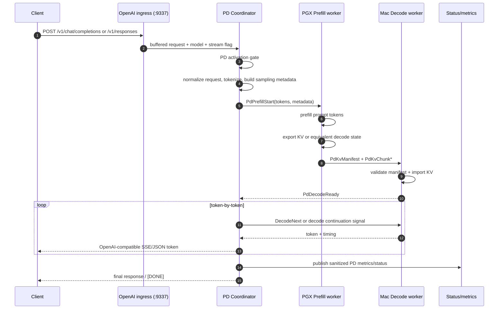
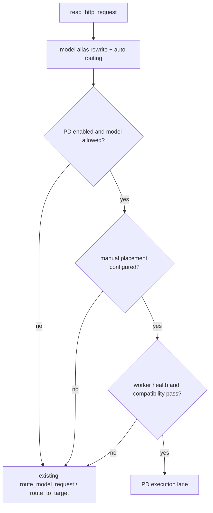
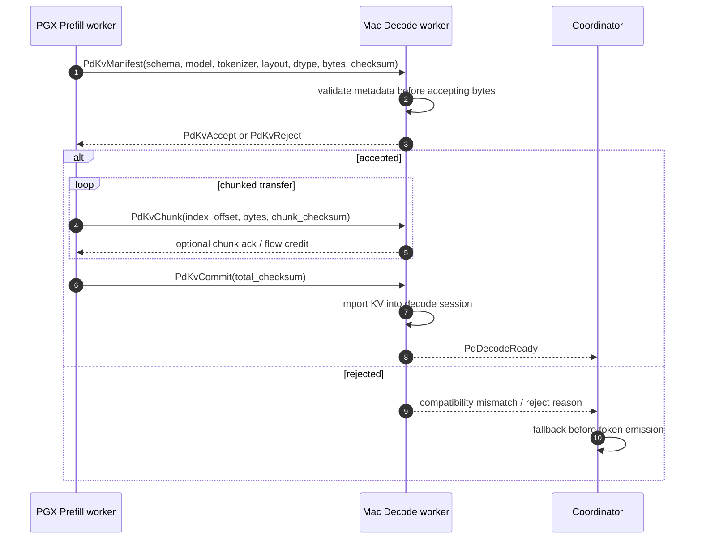
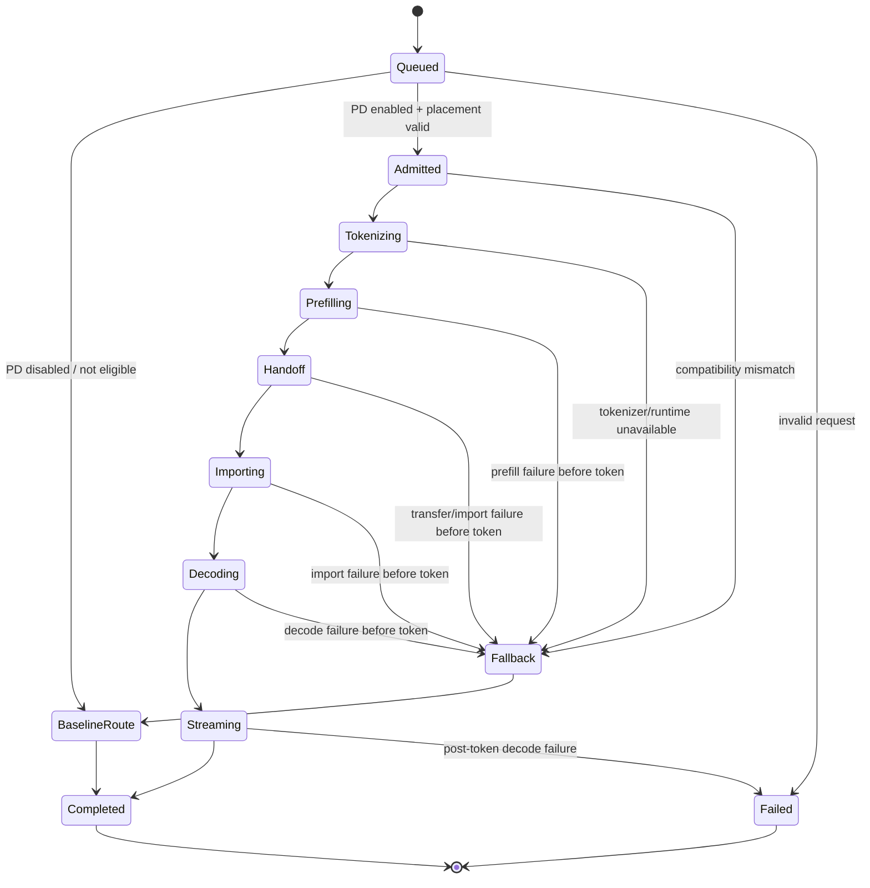
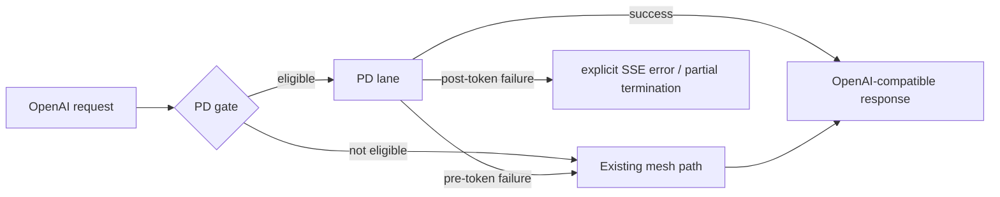

# PD 数据流设计

文档状态：Phase 3 目标架构设计  
生成日期：2026-05-19  
适用范围：`PD-detach` 大型二开  

本文描述请求从进入 mesh-llm 到返回 token 的目标数据流。本文不定义代码补丁。

## 1. 数据流原则

1. 外部请求仍从现有 OpenAI-compatible API 进入。
2. PD 分离只在显式开启且兼容性检查通过时触发。
3. Coordinator 负责请求生命周期和 fallback，worker 不直接面对外部客户端。
4. Tokenization 由 Coordinator/Decode 侧统一完成，Prefill worker 接收 token IDs，避免 PGX 与 Mac 用不同 tokenizer 解释 prompt。
5. KV handoff 必须带 manifest、版本、checksum 和一致性元数据。
6. 首 token 前的 PD 失败可以回退现有 mesh-llm 路径；首 token 后不得透明回退。

证据：`docs/PD-detach/phase-2/PREFILL_DECODE_REQUIREMENTS.zh.md`、`crates/mesh-llm-host-runtime/src/network/openai/ingress.rs`、`crates/mesh-llm-host-runtime/src/network/openai/transport.rs`。

## 2. 正常路径总览

## 3. 入口阶段

当前 OpenAI ingress 会读取完整 HTTP request，提取 `model`、body、stream 信息，并调用 `route_model_request()` 或 `route_to_target()`。PD lane 目标是在这一路径内部新增一个可选分支：

入口阶段不应改变：

- `/v1/*` 和 `/models` 的外部 URL。
- CORS/OPTIONS 行为。
- 现有 `/api/chat*` 到 `/v1/chat/completions` 的 rewrite 行为。
- 默认关闭时的路由逻辑。

代码证据：`crates/mesh-llm-host-runtime/src/api/routes/chat.rs`、`crates/mesh-llm-host-runtime/src/network/openai/ingress.rs`。

## 4. Tokenization 与请求规范化

MVP 推荐由 Mac Studio 上的 Coordinator/Decode runtime 统一 tokenization：

| 数据 | 来源 | 传给 Prefill worker | 传给 Decode worker |
|---|---|---|---|
| model artifact identity | GGUF artifact / runtime descriptor | 是 | 是 |
| tokenizer identity | GGUF 内嵌 `tokenizer.ggml.model=gemma4` 和 tokenizer metadata hash | 是 | 是 |
| chat template identity | GGUF `tokenizer.chat_template` hash | 是 | 是 |
| prompt token IDs | Coordinator tokenization 结果 | 是 | 作为校验和 position 基准 |
| sampling config | OpenAI request normalization 后的 config | 可选，prefill 只需保留元数据 | 是 |
| context/position | token count、position start/end、ctx size | 是 | 是 |

这样设计的原因：

- Phase 2 已确认 tokenizer 以 `google_gemma-4-31B-it-bf16` GGUF artifact 内嵌元数据为权威来源。
- 如果 PGX 和 Mac 各自解析 prompt，chat template 或 tokenizer 差异会导致 KV 与 decode token 序列不匹配。
- 当前 OpenAI request proxy 已经能 buffer request body，PD lane 可以在内部 normalization 后再决定是否执行 PD。

## 5. Prefill 阶段

Prefill worker 正常流程：

1. 收到 `PdPrefillStart`，包含 request id、model identity、tokenizer identity、token IDs、context、KV handoff format version。
2. 校验本地 runtime 是否已加载匹配模型和兼容 KV config。
3. 为该请求创建临时 session。
4. 对 prompt tokens 执行 prefill。
5. 导出 KV cache 或等价 decode 初始状态。
6. 生成 `PdKvManifest`。
7. 分块发送 KV payload 到 decode worker。
8. 等待 decode worker commit/ack，再释放或保留临时状态。

Prefill worker 失败规则：

- prefill 中途失败：不得发送 commit。
- KV 导出失败：fail closed。
- mismatch：返回明确内部错误码，不发送部分 KV。
- 请求取消：释放临时 session。

## 6. KV Handoff 阶段

Handoff 必须观测：

- `kv_handoff_bytes`
- `kv_handoff_chunks`
- `kv_handoff_send_ms`
- `kv_handoff_receive_ms`
- `kv_import_ms`
- `kv_format_version`
- `fallback_reason`

不得观测：

- prompt 文本
- token 内容数组
- KV payload 内容
- credentials、IP/user/password 值
- 本地私有绝对模型路径值，除非只在本地 debug 且不进入 tracked 文档/telemetry

## 7. Decode 阶段

Decode worker 正常流程：

1. 校验 manifest 与本地 runtime。
2. 导入 KV 到请求 session。
3. 以 prompt 最后 token / decode position 作为起点。
4. 执行 token-by-token decode。
5. 每个 token 交给 Coordinator，Coordinator 负责 OpenAI-compatible streaming 或 final JSON。
6. 请求完成、取消或失败时释放临时 KV/session 状态。

Decode 失败规则：

| 失败点 | 对外行为 | 原因 |
|---|---|---|
| import 前失败 | 可 fallback 到现有 mesh path | 客户端还未收到 token。 |
| import 后、首 token 前失败 | 可 fallback 到现有 mesh path | 客户端还未收到 token，但需清理 decode session。 |
| 已向外 streaming 后失败 | 不得透明 fallback；返回 streaming error 或终止 partial。 | fallback 会生成重复/矛盾 token。 |
| 请求取消 | 停止 prefill/handoff/decode，释放临时状态。 | 避免 KV/session 泄漏。 |

## 8. 正常路径状态机

## 9. 失败路径

### 9.1 PD gate 失败

场景：

- PD 未开启。
- 模型不是 MVP 允许模型。
- 手动 placement 未配置。
- PGX 或 Mac worker 不健康。
- `v0.60.0` 版本门槛不满足。
- `pd-handoff/1` 或必要 Skippy capability 未声明。

行为：

- 不进入 PD lane。
- 直接走现有 `route_model_request()` / `route_to_target()`。
- 可记录 sanitized diagnostic：`pd_not_eligible`。

### 9.2 Prefill 失败

场景：

- PGX runtime 未加载模型。
- 模型/tokenizer/KV config mismatch。
- prefill 超时或崩溃。
- 导出 KV 失败。

行为：

- 清理 PGX session。
- 若没有 token 发给客户端，fallback baseline path。
- 记录 `fallback_reason=prefill_failed` 或更具体原因。

### 9.3 Handoff 失败

场景：

- manifest 被拒绝。
- chunk checksum mismatch。
- 网络超时。
- bytes 超过上限。
- Mac import KV 失败。

行为：

- 清理 PGX/Mac 临时 session。
- 首 token 前 fallback。
- 记录 handoff bytes、耗时和失败类别。

### 9.4 Decode 失败

场景：

- decode worker 导入状态后崩溃。
- token generation runtime error。
- streaming client 断开。

行为：

- 首 token 前 fallback。
- 首 token 后终止 SSE，并返回明确 error/partial 结束状态，不透明 fallback。
- 客户端断开时停止后续 prefill/handoff/decode。

## 10. 与现有正常路径的关系

现有正常路径不是备份实现，而是第一版必须保留的产品行为：

- 默认关闭 PD 时用于生产稳定性。
- PD 失败时用于回退。
- 性能验证时作为 baseline。

证据：`docs/PD-detach/phase-2/PREFILL_DECODE_REQUIREMENTS.zh.md` 的 `D-012`、`FR-API-009`、`NFR-COMP-003`。

## 11. 数据分类

| 数据 | 敏感级别 | 可否日志 | 说明 |
|---|---|---|---|
| prompt text | 高 | 不可 | 用户内容。 |
| token IDs | 高 | 默认不可 | 可重构 prompt，最多记录数量和 hash。 |
| KV payload | 高 | 不可 | prompt-derived state。 |
| model identity/hash | 中 | 可 | 不含本地私密路径值。 |
| tokenizer identity/hash | 中 | 可 | 不含 token 内容。 |
| latency/bytes/count | 低 | 可 | 用于性能和诊断。 |
| credentials/IP/user/password | 高 | 不可 | 不进入仓库和 telemetry。 |

## 12. 待 spike 验证

1. Coordinator tokenization 后的 token IDs 是否能直接驱动 PGX runtime prefill。
2. PGX native KV export 是否可被 Mac native runtime import。
3. Mac import 后首 token 与单机 baseline 是否一致。
4. 大 prompt 的 handoff bytes 和 latency 是否可接受。
5. 首 token 后明确 SSE error/partial termination 对 OpenAI client 是否可用。
