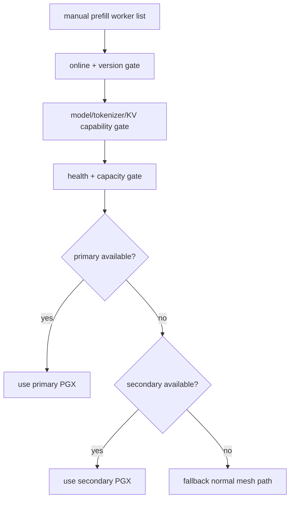
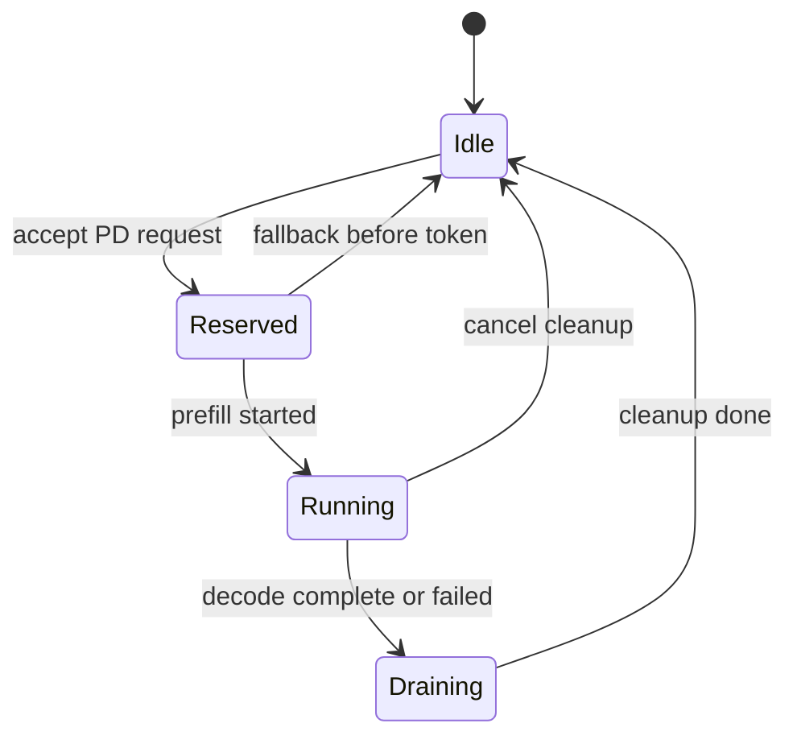

# 角色与调度设计

文档状态：Phase 3 目标架构设计  
生成日期：2026-05-19  
适用范围：`PD-detach` 大型二开  

本文设计 PGX Prefill worker、Mac Decode worker、Coordinator 的角色绑定、选择、健康检查、容量和 backpressure。本文不实现代码。

## 1. MVP 调度结论

MVP 不做全自动调度，采用：

- 默认关闭 PD。
- 手动开启 PD。
- 手动 placement。
- 单 request in-flight。
- 单 decode worker。
- 两台 PGX 中选择一个 active prefill worker，另一个作为手动/健康 fallback 候选。

证据：`docs/PD-detach/phase-2/PREFILL_DECODE_REQUIREMENTS.zh.md` 的 `D-008`、`D-014`、`FR-AP-*`。

## 2. 角色绑定

| 角色 | MVP 绑定 | 原因 |
|---|---|---|
| Coordinator | Mac Studio 上的 mesh-llm 进程 | 靠近 decode worker 和外部 streaming；便于首 token 前 fallback。 |
| Decode worker | Mac Studio | 目标场景明确，利用高内存带宽做 token-by-token decode。 |
| Prefill worker A | PGX 30BE | 手动 placement 候选。 |
| Prefill worker B | PGX 3030 | 手动 placement 候选/备用。 |

测试环境变量来源：

- `MESH_MACSTUDIO_NAME`
- `MESH_MACSTUDIO_IP`
- `MESH_MACSTUDIO_USER`
- `MESH_PGX_30BE_NAME`
- `MESH_PGX_30BE_IP`
- `MESH_PGX_30BE_USER`
- `MESH_PGX_3030_NAME`
- `MESH_PGX_3030_IP`
- `MESH_PGX_3030_USER`
- `MESH_GEMMA_MODEL_NAME`
- `MESH_GEMMA_MODEL_MAC_PATH`
- `MESH_GEMMA_MODEL_PGX_PATH`

这些变量来自 operator-local private env file。文档和后续 OpenSpec 不得复制 password/token/credential 值。

## 3. Role capability model

MVP capability discovery 只用于识别、诊断和校验，不用于自动 placement。

推荐 capability 分层：

| Capability | Prefill worker | Decode worker | Coordinator |
|---|---:|---:|---:|
| `pd.role.prefill` | required | optional | optional |
| `pd.role.decode` | optional | required | optional |
| `pd.role.coordinator` | optional | recommended | required |
| `pd.model_id` | required | required | required |
| `pd.model_artifact_identity` | required | required | required |
| `pd.tokenizer_identity` | required | required | required |
| `pd.kv_format_version` | required | required | required |
| `pd.kv_codec` | required | required | required |
| `pd.backend` | required | required | optional |
| `pd.max_handoff_bytes` | optional | required | required |
| `pd.current_capacity` | required | required | required |

承载位置由 Phase 3 后续 OpenSpec 决定：

- 配置文件只存手动 placement 和 enable policy。
- Gossip 只发布非敏感 capability。
- Management API 展示状态和诊断。
- 任何 capability 字段都必须 additive，不能破坏 `mesh-llm/1`。

## 4. PGX Prefill worker 选择

MVP 推荐选择策略：

1. 从手动配置的 `prefill_workers` 列表读取候选。
2. 过滤不在线或低于 `v0.60.0` 的节点。
3. 过滤未声明兼容 model/tokenizer/KV capability 的节点。
4. 过滤当前 busy 或超过 backpressure 阈值的节点。
5. 优先选择 primary PGX；失败时可尝试 secondary PGX。
6. 若没有候选，首 token 前 fallback 现有 mesh path。

不建议 MVP 直接根据实时性能自动选择 PGX，因为这会把功能打通、性能策略、故障恢复混在一起。

## 5. Mac Decode worker 绑定

MVP decode worker 固定为 Mac Studio。

绑定要求：

- Mac Studio 必须加载 MVP 模型 artifact。
- Mac Studio 必须能读取 GGUF 内嵌 tokenizer metadata。
- Mac Studio 必须声明与 PGX handoff 兼容的 KV format/runtime ABI。
- Decode worker 与 Coordinator 可以在同一进程/同一节点内耦合，但架构文档中保持职责分离。

如果 Mac decode worker 不健康：

- PD lane 不可用。
- 请求走现有 normal mesh path。
- Status surface 显示 `pd_unavailable: decode_worker_unhealthy`。

## 6. Coordinator 选择

ADR 选择集中式 Coordinator，MVP 中位于 Mac Studio。理由：

- 外部 streaming 响应由一个节点负责，状态机简单。
- 单 request MVP 可以用单个 admission gate。
- fallback 行为更可控。
- 与 decode worker 同节点，避免 token streaming 再跨一次网络。

未来可以支持 Coordinator 迁移或 leader election，但不进入 MVP。

## 7. 单请求 MVP

MVP admission：

单请求限制：

- 只允许一个 PD request in-flight。
- 若已有 PD request，新的请求直接走 normal mesh path 或返回 `pd_busy` 后 fallback。
- 不排队长队列，避免第一版出现不可诊断延迟。

## 8. 后续并发扩展

后续扩展可以按以下顺序演进：

1. Mac decode worker 支持多个 decode lanes。
2. PGX prefill worker 支持 bounded prefill queue。
3. 多 request admission queue。
4. 根据 prompt length 判断是否进入 PD。
5. 根据 PGX load、Mac decode load、network latency 自动选择 prefill worker。
6. 支持多个 decode workers。

并发扩展前必须先有：

- 请求级状态机。
- lane/session 生命周期。
- 取消和 cleanup 语义。
- per-worker capacity metric。
- per-worker backpressure。

## 9. Health check

MVP health check 分四层：

| 层级 | 检查 | 证据/来源 |
|---|---|---|
| mesh health | peer online、version >= `v0.60.0`、subprotocol capability | `mesh/gossip.rs`、`PROTOCOL_COMPATIBILITY.md` |
| model health | model loaded、artifact identity、ctx_size、tokenizer identity | runtime descriptors / future PD capability |
| runtime health | prefill/decode runtime ready、stage status ready、last_error empty | `/api/runtime/stages`、`api/status.rs` |
| PD health | handoff format supported、capacity available、last failure not active | future PD status |

Health check 不应读取 prompt 或 KV 内容。

## 10. Capacity 与 backpressure

MVP capacity：

- `pd_inflight_limit = 1`
- `prefill_worker_inflight_limit = 1`
- `decode_worker_inflight_limit = 1`
- `handoff_bytes_limit` 必须在 spike 后确定。
- `handoff_timeout` 必须在 spike 后确定。

Backpressure 行为：

| 场景 | MVP 行为 |
|---|---|
| Coordinator busy | fallback normal mesh path，记录 `pd_busy`。 |
| PGX prefill busy | 尝试 secondary PGX；都 busy 则 fallback。 |
| Mac decode busy | fallback。 |
| handoff bytes 超过上限 | fallback 或明确错误，不能继续 PD。 |
| 网络超时 | 首 token 前 fallback；首 token 后明确 SSE error/partial termination，不透明 fallback。 |

## 11. Status 与诊断

MVP 至少需要可诊断：

- PD 是否 enabled。
- 当前 Coordinator node。
- 手动配置的 prefill/decode workers。
- 当前 active request state。
- 最近一次 fallback reason。
- 最近一次 handoff bytes/latency。
- worker health：online、model match、tokenizer match、KV format match、capacity。

可复用 surface：

- `/api/status`
- `/api/runtime/stages`
- `/api/events`

证据：`docs/PD-detach/phase-1/API_REFERENCE.md`、`crates/mesh-llm-host-runtime/src/api/status.rs`、`crates/mesh-llm-host-runtime/src/api/mod.rs`。

## 12. 不进入 MVP 的调度能力

| 能力 | 原因 |
|---|---|
| 自动发现后直接启用 worker | 安全和正确性风险过高。 |
| 多 decode workers | 会引入 KV placement 和 decode affinity 复杂度。 |
| 多 request 排队 | 会掩盖 handoff/latency 问题。 |
| 基于性能自动 placement | 需要可靠 metrics 和长期稳定性数据。 |
| 公共 mesh 跨 owner PD | trust boundary 未定义，KV 是敏感数据。 |

## 13. Spike/prototype 问题

1. Capacity 是否可以从现有 runtime/stage status 推导，还是必须新增 PD-specific status。
2. PGX prefill worker 切换时是否允许同一请求重试另一个 PGX。
3. Prefill worker 是否需要常驻加载完整模型，还是可以只加载 prefill 所需 runtime。
4. Mac decode worker 与 Coordinator 同进程时，如何避免后续演进中职责耦合。
5. Busy 时 fallback normal path 是否会造成用户感知不稳定，需要 status 明确说明。
