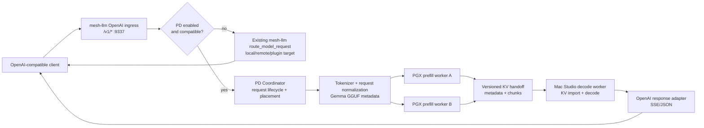
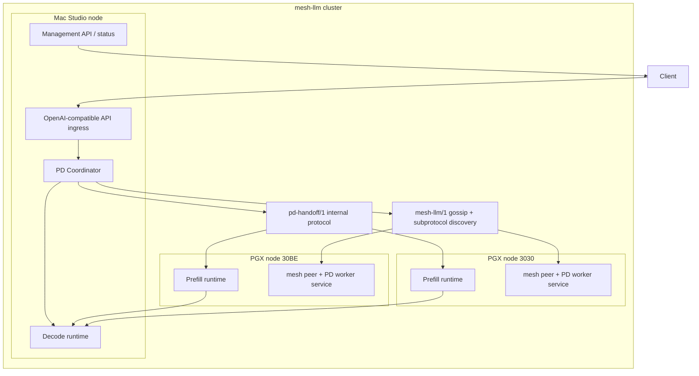
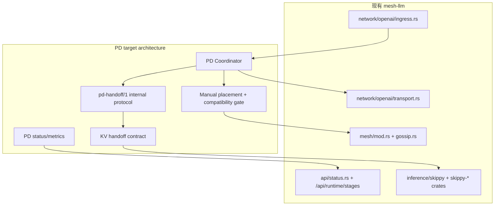

# 异构 Prefill/Decode 分离目标架构

文档状态：Phase 3 目标架构设计  
生成日期：2026-05-19  
适用范围：`PD-detach` 大型二开  

本文只做架构设计，不是实现补丁，不创建 OpenSpec change，不修改业务代码或运行默认值。

## 1. 设计输入

| 输入 | 结论 | 证据 |
|---|---|---|
| Phase 2 Go | 需求与范围已可进入架构设计。 | `docs/PD-detach/phase-2/PHASE_2_EXIT_REVIEW.zh.md` |
| 目标场景 | 两台 PGX 做 prefill workers，一台 Mac Studio 做 decode worker。 | `docs/PD-detach/phase-2/PREFILL_DECODE_REQUIREMENTS.zh.md` |
| API 兼容 | 外部尽量保持 OpenAI-compatible API，保留非 PD baseline/fallback。 | `docs/PD-detach/phase-2/PREFILL_DECODE_REQUIREMENTS.zh.md`、`docs/PD-detach/phase-1/API_REFERENCE.md` |
| 协议边界 | 正式 mesh protocol 是 `mesh-llm/1`，`mesh-llm/0` 只是遗留兼容，`v0.60.0` 是最低节点版本门槛。 | `docs/PD-detach/phase-1/PROTOCOL_COMPATIBILITY.md` |
| Skippy 现状 | Skippy 已有 stage control、transport、runtime status、binary activation transport 和 KV cache 相关代码。 | `crates/skippy-protocol/`、`crates/skippy-server/`、`crates/mesh-llm-host-runtime/src/inference/skippy/` |
| 安全边界 | KV cache 属于 prompt-derived 敏感数据，不得写入日志/telemetry/错误响应。 | `docs/PD-detach/phase-1/SECURITY_AND_PRIVACY.md`、`docs/PD-detach/phase-2/PREFILL_DECODE_REQUIREMENTS.zh.md` |

## 2. 目标架构总览

目标架构是在现有 mesh-llm host runtime 内新增一条**显式开启、可回退、可观测**的 PD execution lane：

1. 外部客户端仍调用现有 `/v1/*` 或 `/models` OpenAI-compatible surface。
2. Coordinator 在 OpenAI ingress/router 侧判断该请求是否满足 PD 条件。
3. 若 PD 未开启、条件不满足、worker 不健康或兼容性校验失败，请求走现有 mesh-llm 正常路径。
4. 若 PD 条件满足，Coordinator 负责 tokenization/compatibility/admission，选择 PGX prefill worker 和 Mac decode worker。
5. PGX prefill worker 对 prompt tokens 执行 prefill，导出 KV cache 或等价 decode 初始状态。
6. Mac decode worker 校验并导入 handoff 状态，继续 token-by-token decode。
7. Coordinator 将 token 以现有 OpenAI-compatible 响应形态返回给客户端。

## 3. C4 视角

## 4. 角色职责

### 4.1 Coordinator

推荐 MVP 中由 Mac Studio 上的 mesh-llm 进程承担 Coordinator，因为它天然靠近 decode worker 和外部 streaming 响应。

职责：

- 接收现有 OpenAI-compatible 请求。
- 判断 PD 是否显式开启，且当前模型是否是 MVP 允许模型。
- 解析请求，统一 tokenization 和 sampling/chat template 元数据。
- 根据手动配置选择一个 PGX prefill worker 和一个 Mac decode worker。
- 校验模型 artifact、tokenizer、context、KV 格式、dtype、backend capability。
- 管理请求状态：`queued`、`admitted`、`prefilling`、`handoff`、`decoding`、`streaming`、`completed`、`failed`、`fallback`、`cancelled`。
- 在未向客户端输出 token 前，PD 失败时回退现有 mesh-llm 正常路径。
- 记录不含 prompt/KV 内容的关键指标：prefill latency、handoff bytes、handoff latency、decode tokens/sec、TTFT、fallback reason。

### 4.2 Prefill Worker

MVP 中是两台 PGX 节点，默认不自动参与，必须被手动 placement 允许。

职责：

- 加载与 decode worker 兼容的同一模型 artifact。
- 接收 Coordinator 分配的 prefill request。
- 使用 Coordinator 给出的 token IDs、position/context/sampling metadata 执行 prefill。
- 导出 KV cache 或等价 decode 初始状态。
- 产生 handoff manifest 和分块校验信息。
- 在失败、取消、超时或兼容性 mismatch 时 fail closed，不交接不可验证状态。

### 4.3 Decode Worker

MVP 中是 Mac Studio 节点。

职责：

- 加载同一模型 artifact 和 tokenizer metadata。
- 校验 handoff manifest：模型、tokenizer、context、position、KV ABI、dtype、layout、token_count、checksum。
- 导入 KV cache 或等价状态。
- 继续 decode 并把 token 交给 Coordinator 的 OpenAI response adapter。
- 失败或取消时释放临时 KV/session 状态。

## 5. 与现有 mesh-llm 模块的映射关系

| 目标架构职责 | 当前代码位置 | 设计使用方式 |
|---|---|---|
| 外部 OpenAI-compatible ingress | `crates/mesh-llm-host-runtime/src/network/openai/ingress.rs`、`crates/mesh-llm-host-runtime/src/network/openai/transport.rs`、`crates/mesh-llm-host-runtime/src/api/routes/chat.rs` | PD lane 应作为现有路由前的可选 execution path；默认关闭时不改变当前 route 行为。 |
| 模型路由与 fallback | `route_model_request()`、`route_to_target()` in `network/openai/transport.rs` | PD pre-token failure 回退到现有正常路由；fallback reason 进入诊断指标。 |
| 模型目标和候选 | `crates/mesh-llm-host-runtime/src/inference/election.rs`、`crates/mesh-llm-routing/` | MVP 不做自动调度；只复用模型/target/status 信息做校验和 fallback。 |
| mesh membership/gossip | `crates/mesh-llm-host-runtime/src/mesh/`、`crates/mesh-llm-protocol/proto/node.proto` | PD capability 只能 additive；不破坏 `mesh-llm/1`，不扩大 `/0`。 |
| subprotocol discovery | `PeerAnnouncement.subprotocols`、`MeshSubprotocol`、`STREAM_SUBPROTOCOL` | 目标内部协议边界为 `pd-handoff/1` capability；spike 阶段可复用 Skippy transport / KV 代码，但不把 PD 语义永久并入 `skippy-stage/1`。 |
| Skippy stage control/status | `crates/skippy-protocol/proto/stage.proto`、`crates/mesh-llm-host-runtime/src/inference/skippy/stage/`、`/api/runtime/stages` | 复用 stage control/status 的经验和部分 payload 形状，但 PD 不是按层 stage split 的简单替代。 |
| Skippy runtime embedding | `crates/skippy-server/src/embedded.rs`、`crates/mesh-llm-host-runtime/src/inference/skippy/mod.rs` | 作为 prefill/decode runtime 候选基础；优先 spike native KV export/import 能否跨 PGX/Mac 工作。 |
| KV manifest/identity | `crates/skippy-server/src/kv_proto.rs`、`crates/skippy-server/src/kv_integration/identity.rs`、`crates/skippy-cache/src/identity.rs` | 作为 PD handoff metadata 的候选起点；必须补足跨机器、跨 backend 验证字段。 |
| 管理/status API | `crates/mesh-llm-host-runtime/src/api/status.rs`、`/api/runtime/stages` | MVP 至少暴露 PD mode、worker、状态、最近失败原因和关键指标；不泄露 prompt/KV。 |
| 配置入口 | `crates/mesh-llm-host-runtime/src/plugin/config.rs`、`docs/PD-detach/phase-1/CONFIGURATION.md` | 设计新的 PD 配置 surface 时不得修改默认值；MVP 手动开启。 |

## 6. 为什么不是直接套现有 Skippy split serving

现有 Skippy split serving 的核心语义是**按层切分**，token IDs 和 activation frames 穿过 stage chain；decode 每个 token 仍要经过多个 stage。目标 PD 分离要求 PGX 完成 prompt/prefill 后，把 KV cache 或等价 decode 初始状态交给 Mac，然后 Mac 负责 token-by-token decode。

因此：

- Skippy 的 stage control、transport、runtime embedding、status、telemetry、KV page 代码值得优先复用。
- Skippy 的 activation chain 不能直接视为 PD MVP 完成。
- 是否能复用 Skippy native KV export/import 是必须 spike 的架构问题。

证据：`crates/skippy-server/README.md`、`crates/skippy-protocol/README.md`、`crates/skippy-server/src/kv_integration/exact_state.rs`、`crates/skippy-server/src/kv_proto.rs`。

## 7. API 兼容方式

外部 API 保持方式：

- `/v1/*`、`/models`、`/api/chat*`、`/api/responses*` 不改 endpoint。
- PD 是否启用不要求客户端理解新的 URL。
- 非 PD 路径保留，既是 fallback，也是 baseline。
- 未来若支持 per-request 控制，只能作为非破坏性扩展字段或管理/config policy，不能替换现有 OpenAI-compatible surface。

内部变化：

- Coordinator 在 OpenAI ingress 内部选择 PD lane。
- PD lane 成功时仍返回 OpenAI-compatible JSON/SSE。
- PD lane 在首 token 前失败时回退现有 mesh path。
- PD lane 在已经 streaming token 后失败时不得伪造后续 token；MVP 推荐终止 SSE，并返回明确 error/partial 结束状态。

## 8. 架构原则

1. **默认不影响现有行为**：PD 默认关闭，未配置时完全走现有路径。
2. **手动 placement 优先**：MVP 不自动把发现到的节点纳入 PD。
3. **一致性先于性能**：模型、tokenizer、KV ABI、dtype、layout 不一致时 fail closed。
4. **KV 视为敏感数据**：不记录内容，不进入 telemetry，不写 tracked 文档。
5. **可回退但不伪造**：首 token 前可 fallback；首 token 后只能明确失败或结束 partial。
6. **可测量 baseline**：不承诺第一版固定收益，必须能测出 prefill、handoff、decode 分段数据。
7. **不要把 Gemma 写死进架构**：`google_gemma-4-31B-it-bf16` 是 MVP 测试模型，不是最终模型边界。

## 9. Mermaid 组件关系图

## 10. 必须进入 spike/prototype 的问题

| 问题 | 为什么必须 spike | 最小验证 |
|---|---|---|
| PGX 导出的 native KV 能否被 Mac runtime 导入并继续 decode | 这是 PD MVP 成败关键；跨 CUDA/Metal/native layout 风险最大。 | 同一 prompt，PGX prefill + Mac decode 输出与单机 baseline 可解释一致。 |
| 真实 KV bytes/token 与 handoff latency | 估算不足以决定网络可行性。 | 对 MVP Gemma prompt 长度采集实际导出字节数和传输耗时。 |
| `cache_type_k/v=f16` 与 bf16 model artifact 的关系 | bf16 权重不等于 bf16 KV；现有 Skippy KV codec 是 `Fp16`。 | Runtime metadata 和导出 manifest 明确 KV dtype/codec。 |
| Skippy export/import API 是否足以服务跨机器 handoff | 现有代码偏 cache/prefix 场景，未证明跨机器 PD 语义。 | 本机跨进程、再跨 PGX/Mac 的 export/import prototype。 |
| Streaming 失败后的外部行为 | 首 token 后无法透明 fallback。 | 验证明确 SSE error/partial termination 对 OpenAI client 可用。 |
