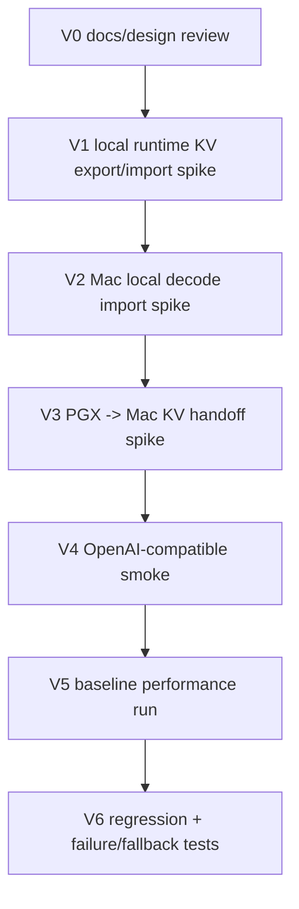

# 验证计划

文档状态：Phase 3 目标架构设计  
生成日期：2026-05-19  
适用范围：`PD-detach` 大型二开  

本文定义 PD 分离架构进入实现前后的正确性、性能、网络/KV、回归验证计划。本文不运行测试。

## 1. 验证原则

1. 先验证正确性，再验证性能。
2. 先验证 local/export/import，再验证跨机器。
3. 先单 request，再考虑并发。
4. 所有 PD 测试必须保留 normal mesh baseline。
5. 旧 benchmark 不能作为当前性能承诺，必须重跑并标日期。
6. 日志和 telemetry 不记录 prompt 内容、token array、KV payload、credentials。

证据：`docs/PD-detach/phase-1/TEST_MATRIX.md`、`docs/PD-detach/phase-2/PREFILL_DECODE_REQUIREMENTS.zh.md`。

## 2. 最小验证阶段

推荐第一份 OpenSpec change 命名为 `pd-kv-handoff-spike`。该 change 的目标不是交付完整 PD MVP，而是验证 PGX prefill 后导出的 KV / decode state 能否被 Mac 正确导入并继续 decode。

`pd-kv-handoff-spike` 最小通过标准：

1. PGX 加载 MVP 模型 `google_gemma-4-31B-it-bf16`，使用固定 prompt 完成 prefill。
2. PGX 导出 KV / decode state，并生成 manifest。
3. Mac 加载相同 `sha256` 的模型 artifact。
4. Mac 校验 manifest，导入 KV，从正确 decode position 继续生成。
5. 使用 deterministic 设置，例如 `temperature=0` 或固定 seed，对比 baseline 输出达到可解释一致。
6. 记录 `kv_handoff_bytes`、`kv_export_ms`、`kv_handoff_latency_ms`、`kv_import_ms`、`ttft_ms`、`decode_tokens_per_sec`、`fallback_reason`。
7. 构造 model/tokenizer/KV mismatch 时必须 fail closed，不输出疑似正确 token。

## 3. 正确性验证

| ID | 验证项 | 方法 | 通过标准 |
|---|---|---|---|
| COR-001 | Tokenizer identity | 对 MVP GGUF 读取 tokenizer metadata hash，并单独读取 `tokenizer.chat_template` hash。 | Mac/PGX tokenization identity 一致。 |
| COR-002 | Prompt tokenization | Coordinator tokenization 后，PGX 不重新解释 prompt 文本。 | PGX 使用 token IDs prefill。 |
| COR-003 | Model artifact identity | Mac/PGX 模型文件内容 `sha256` 对比。 | `sha256` mismatch 时 fail closed。 |
| COR-004 | Same-host export/import | 同一机器导出 KV 后导入 decode。 | greedy decode 与 baseline 可解释一致。 |
| COR-005 | Cross-process export/import | 本机两个进程之间 handoff。 | manifest + payload 足以恢复 decode state。 |
| COR-006 | Cross-machine PGX->Mac | PGX prefill，Mac decode。 | 输出与 baseline 可解释一致。 |
| COR-007 | Context/position | 使用不同 prompt 长度验证 position 起点。 | 首 token/后续 token 无 position mismatch。 |
| COR-008 | Mismatch fail closed | 构造 model/tokenizer/KV version mismatch。 | 不输出疑似正确 token，且 fallback 或明确错误。 |
| COR-009 | Streaming correctness | streaming path token 顺序正确。 | SSE order 与 final text 一致。 |
| COR-010 | Cancel cleanup | 客户端取消请求。 | PGX/Mac 临时 session 和 KV 状态释放。 |

建议正确性采样：

- 短 prompt。
- 中等 prompt。
- 长 prompt。
- 接近 MVP 目标上下文的长 prompt。
- deterministic decode：temperature 0 或固定 seed 的可解释设置。

## 4. 性能验证

MVP 性能口径是：功能打通、单用户可用、可测量 baseline。

必须采集：

| 指标 | 说明 |
|---|---|
| `end_to_end_latency_ms` | 总请求耗时。 |
| `ttft_ms` | Time to first token。 |
| `prefill_latency_ms` | PGX prefill 计算耗时。 |
| `kv_export_ms` | PGX 导出 KV 耗时。 |
| `kv_handoff_bytes` | KV payload 总字节数。 |
| `kv_handoff_latency_ms` | 网络传输耗时。 |
| `kv_import_ms` | Mac 导入 KV 耗时。 |
| `decode_tokens_per_sec` | Mac decode 吞吐。 |
| `fallback_rate` | PD 请求 fallback 比例。 |
| `failure_rate` | 请求失败比例。 |

Baseline 矩阵：

| Baseline | 目的 |
|---|---|
| Mac-only full inference | Mac 完整推理基线。 |
| PGX-only full inference | PGX 完整推理基线。 |
| Existing mesh normal path | 当前产品路径基线。 |
| PGX prefill + Mac decode PD path | 新路径数据。 |

Prompt 分组：

| 分组 | 目的 |
|---|---|
| 短 prompt | 验证 PD overhead 是否明显退化。 |
| 中 prompt | 观察 handoff 和 prefill tradeoff。 |
| 长 prompt | 目标收益场景。 |
| 极长 prompt | 网络/KV 上限和 timeout 风险。 |

## 5. 网络/KV 传输验证

| ID | 验证项 | 方法 | 通过标准 |
|---|---|---|---|
| NET-001 | KV bytes 实测 | 从 runtime export payload 记录总 bytes。 | 有稳定 bytes/token 数据。 |
| NET-002 | Chunk 校验 | 每 chunk checksum + total checksum。 | mismatch 可被检测。 |
| NET-003 | Handoff timeout | 注入慢网络或小 timeout。 | 首 token 前 fallback，状态清理。 |
| NET-004 | Transfer interruption | 中断 PGX->Mac handoff。 | Decode 不导入 partial KV。 |
| NET-005 | Backpressure | Mac 接收变慢。 | PGX 受控等待或失败，不无限内存增长。 |
| NET-006 | Sensitive data audit | 检查日志/telemetry。 | 无 prompt/KV/token array/credential。 |

## 6. 回归验证

因为 PD 必须默认关闭并保留 normal path，回归验证至少覆盖：

| 回归项 | 通过标准 |
|---|---|
| PD 默认关闭 | `/v1/*` 走现有 normal route。 |
| `/models` | 模型列表不破坏。 |
| `/api/status` | 现有 payload 兼容，新增字段 additive。 |
| `/api/runtime/stages` | 现有 Skippy stage status 不被破坏。 |
| normal mesh routing | 本地/远程模型请求仍可用。 |
| fallback | PD pre-token failure 后 normal path 可响应。 |
| no OpenSpec side effects | 设计阶段不创建 OpenSpec change。 |
| no config default change | 未配置 PD 时行为不变。 |

参考测试入口：

- Docs-only 阶段：无需 build，人工检查路径和链接。
- 后续 Rust/API 改动：`cargo test -p mesh-llm --lib`。
- Skippy protocol/runtime 改动：`cargo test -p skippy-protocol --lib`、`cargo test -p skippy-server --lib`。
- OpenAI surface smoke：`/v1/models`、`/v1/chat/completions`。

证据：`docs/PD-detach/phase-1/TEST_MATRIX.md`、`crates/skippy-server/README.md`、`crates/skippy-protocol/README.md`。

## 7. Failure/fallback 验证

| ID | 场景 | 预期 |
|---|---|---|
| FT-001 | PD disabled | normal path。 |
| FT-002 | Missing prefill worker | normal path fallback。 |
| FT-003 | Missing decode worker | normal path fallback。 |
| FT-004 | PGX prefill crash | 首 token 前 fallback。 |
| FT-005 | KV manifest mismatch | fail closed + fallback。 |
| FT-006 | KV checksum mismatch | fail closed + fallback。 |
| FT-007 | Mac import failure | 首 token 前 fallback。 |
| FT-008 | Decode failure before token | fallback。 |
| FT-009 | Decode failure after token | 明确 SSE error/partial termination，不 fallback。 |
| FT-010 | Client cancel | PGX/Mac cleanup。 |

## 8. 最小验收清单

进入 MVP OpenSpec 完整实现前，至少需要满足：

- [ ] KV export/import spike 在 PGX->Mac 上成功，或明确替代方案。
- [ ] `PdKvManifest` 字段集确定。
- [ ] model artifact identity 使用模型文件内容 `sha256` 的 MVP 最小规则确定。
- [ ] tokenizer/chat template identity 使用 GGUF tokenizer metadata hash + `tokenizer.chat_template` hash 的 MVP 最小规则确定。
- [ ] Handoff bytes/latency baseline 有数据。
- [ ] Post-token streaming failure policy 确定为明确 SSE error/partial termination，不透明 fallback。
- [ ] PD status 不泄露敏感数据。
- [ ] Normal path fallback smoke 通过。
- [ ] Baseline 矩阵脚本或手工步骤确定。
- [ ] 第一份 OpenSpec change 明确为 `pd-kv-handoff-spike`，完整 MVP proposal 以后置方式推进。

## 9. Phase 3 本身验证

本次阶段是 docs-only，验证标准：

| 检查项 | 标准 |
|---|---|
| 只改 docs/PD-detach/phase-3 | 不改业务代码。 |
| 架构文档齐全 | 目标架构、数据流、KV、角色调度、API 协议、部署、验证、ADR、Exit Review。 |
| 每个关键判断有证据路径 | 引用 Phase 1/2 文档或当前代码路径。 |
| Spike 标记明确 | 不把未知写成确定实现。 |
| 未启动远端部署 | 只读代码和文档。 |
