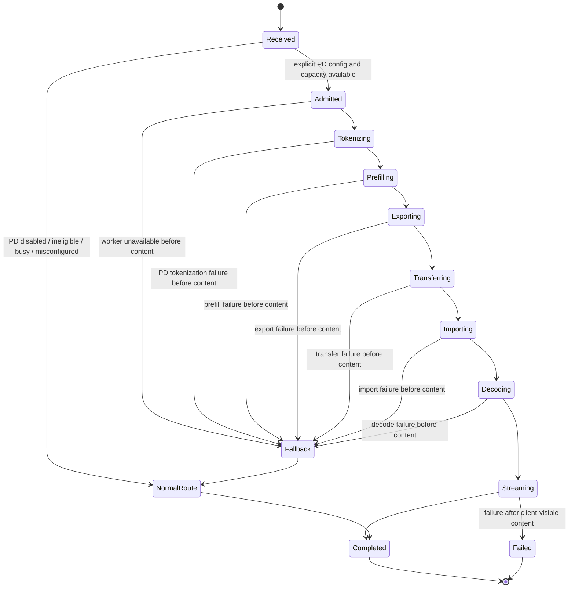

# Design: PD Disaggregated Serving MVP

## Context

The project has already moved through requirements, target architecture, and
three validation changes. The MVP should not restart architecture discovery. It
should take the validated PGX -> Mac handoff path and harden it into a bounded
serving lane with clear operator controls.

Carry-forward evidence:

- `pd-kv-handoff-spike`: native PGX prefill/export -> Mac import/decode is
  feasible for the validated prompt suite.
- `pd-router-validation`: a real OpenAI-compatible router path exists and
  proves positive serving, manifest mismatch fail-closed, and pre-token
  fallback for the validation path.
- `pd-router-validation-followup`: isolated network-only transfer timing and
  post-content-token failure semantics pass.

The MVP remains narrower than the long-term target architecture. It is not a
production scheduler and not a public mesh capability.

## From Validation-only Path To Scoped MVP

The validation-only path was intentionally named and gated for live validation.
The MVP should evolve it through hardening rather than replacing it:

| Validation-only behavior | Scoped MVP behavior |
|---|---|
| Explicit validation flag enables the path | Explicit MVP config enables the path; default remains off |
| One Mac router/decode process and one PGX prefill process | Same topology for MVP |
| Synthetic validation report and fault injection modes | Operator runbook, report template, and test-only fault hooks |
| Validation-oriented manifest checks | Required serving manifest validation and fail-closed behavior |
| Timing collected for evidence | Sanitized serving telemetry/status fields |
| Positive path plus injected failures | Positive path, fallback semantics, cancellation, cleanup, and regression tests |

The MVP should remove validation-only terminology from the operator-facing
configuration and status surface, but may keep test-only fault injection behind
test or validation flags.

## Target MVP Topology

```text
Client
  -> Mac OpenAI-compatible ingress/router
  -> Mac PD coordinator/admission gate
  -> PGX prefill/export worker
  -> Mac import/decode worker
  -> Client
```

MVP topology constraints:

- Exactly one Mac coordinator/router/decode worker.
- Exactly one active PGX prefill worker per MVP request.
- Single request in-flight by default, or a strictly bounded equivalent with a
  clear admission gate.
- Manual placement only.
- No public mesh cross-owner participation.
- No automatic placement or model selection.

## Configuration And Default-off Gate

The MVP must be disabled unless an operator explicitly configures it. A valid
configuration must include:

- PD serving enabled.
- Allowed model ID or model artifact identity.
- Expected model artifact sha256.
- Expected tokenizer metadata hash.
- Expected chat template hash.
- Prefill worker endpoint or resolved local/mesh target.
- Decode worker endpoint or local decode role.
- KV handoff schema/runtime ABI expectations.
- In-flight limit and timeouts.
- Fallback policy.

Missing required fields must fail startup or mark PD unavailable before serving
requests. They must not silently enable partial PD behavior.

The default normal route and existing Skippy split serving route must remain
unchanged when PD is disabled, misconfigured, unsupported for a request, or
busy.

## Role, Capability, And Status

MVP role model:

- Coordinator/router: Mac-side request lifecycle owner.
- Prefill worker: PGX-side prompt prefill and native state export owner.
- Decode worker: Mac-side native state import and token decode owner.

MVP capability/status should be additive and sanitized:

- `pd.enabled`
- `pd.available`
- `pd.mode`
- `pd.coordinator_role`
- `pd.prefill_worker_role`
- `pd.decode_worker_role`
- `pd.allowed_model`
- `pd.kv_format_version`
- `pd.inflight_limit`
- `pd.current_state`
- `pd.last_result`
- `pd.last_fallback_reason`
- `pd.last_failure_phase`
- `pd.last_timing_summary`

Status must not include prompt text, token arrays, KV payload contents,
credentials, private paths, or raw private machine details.

## MVP Request Lifecycle



Coordinator-owned tokenization remains a hard requirement. PGX receives token
IDs plus metadata, not raw prompt text as the authority for prompt
interpretation.

## Manifest Validation And Fail-closed Behavior

The MVP continues using the validated `pd-handoff/1` manifest shape and must
fail closed on mismatch. Required checks:

- schema/version compatibility;
- model artifact sha256;
- tokenizer metadata hash;
- chat template hash;
- context size and decode position;
- KV dtype, codec, layout, byte order, and runtime ABI;
- source/target role identity;
- byte count and payload checksum;
- request/session identity consistency.

Fail closed means the decode worker must not import or continue decode from an
untrusted, partial, mismatched, or corrupt payload. If no client-visible content
has been emitted, the coordinator may fall back to the normal route. If content
has been emitted, fallback must remain blocked.

## Fallback And Error Semantics

Fallback rules:

- PD disabled: use normal route.
- PD ineligible: use normal route.
- PD busy: use normal route or reject according to configured MVP policy.
- Manifest mismatch before content: fail closed and fallback or return a clear
  pre-content error, depending on configured policy.
- Prefill/export/transfer/import/decode failure before content: fallback is
  allowed.
- Failure after client-visible assistant content: transparent fallback is not
  allowed; streaming must return explicit SSE error behavior or documented
  partial termination.

The fallback path must record sanitized reason codes. It must not hide a
post-content failure by mixing normal-route tokens into an already started PD
stream.

## Telemetry And Reporting

Required sanitized metrics:

- `pd.kv_payload_bytes`
- `pd.kv_export_ms`
- `pd.kv_export_roundtrip_ms`
- `pd.kv_network_read_ms`
- `pd.kv_network_write_ms`
- `pd.kv_transfer_network_ms`
- `pd.kv_transfer_isolated`
- `pd.kv_import_ms`
- `pd.router_overhead_ms`
- `pd.ttft_ms`
- `pd.decode_tokens_per_sec`
- `pd.validation_or_mvp.result`
- `pd.failure_phase`
- `pd.fallback_reason`

The MVP may refine metric names, but it must preserve the timing boundaries
proven by `pd-router-validation-followup`: transfer timing excludes PGX export
and Mac import work.

The MVP report/runbook should record:

- result: pass / fail / inconclusive;
- tested topology and sanitized roles;
- artifact/tokenizer/chat-template identity hashes;
- positive prompt IDs, not prompt text;
- timing table;
- manifest/fallback/error results;
- cleanup confirmation;
- recommendation for next scale-up change.

## Tests And Validation Strategy

Minimum local validation:

- config default-off tests;
- missing required config tests;
- manifest positive/negative tests;
- fallback before content tests;
- post-content failure tests;
- telemetry privacy/sanitization tests;
- normal route regression tests;
- Skippy split path regression tests where relevant.

Minimum foreground machine validation:

- start one PGX prefill/export worker;
- start Mac decode/import and OpenAI-compatible router;
- run positive prompt suite;
- run manifest mismatch;
- run pre-content fallback;
- run post-content failure;
- record isolated network timing;
- stop foreground processes and confirm ports release.

## Non-goals

This MVP design does not include multiple decode workers, automatic PGX
placement, production concurrent scheduling, public mesh cross-owner PD, KV
compression, incremental transfer, low precision KV compatibility, automatic
model selection, or default-on external behavior.
