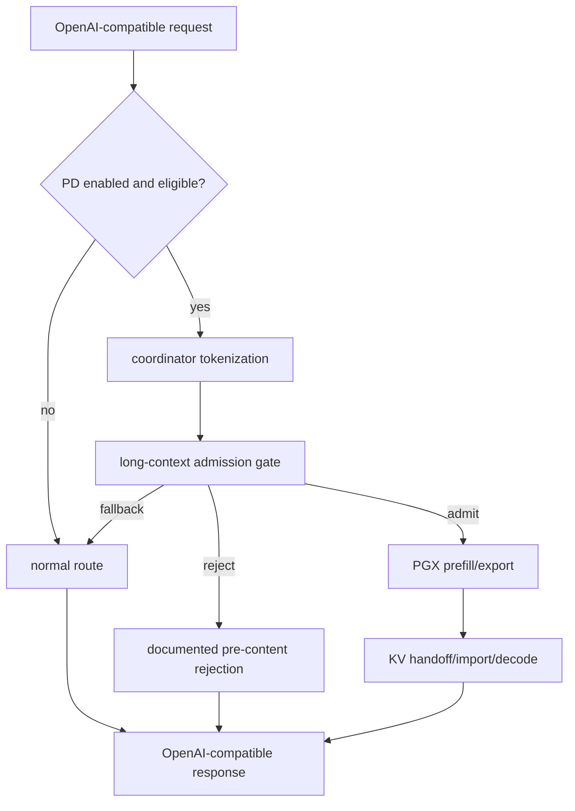

# Design: PD Long Context Admission

## Context

The scoped PD serving MVP already proves the core path:

```text
OpenAI-compatible /v1/chat/completions
  -> Mac coordinator/router/decode
  -> PGX prefill/export
  -> native KV/decode-state handoff
  -> Mac import/decode
  -> OpenAI-compatible response
```

The next blocker is not whether native handoff works. The blocker is whether
the router can keep unsafe long-context requests from entering the PGX prefill
stage. Manual long prompt testing found that a PGX stage with `n_batch=2048`
can be overwhelmed by an over-limit prompt. Once the PGX prefill process exits,
the Mac router only sees a late handoff/buffer read failure. Admission must
happen before PGX prefill starts.

## Admission Position In The Request Lifecycle

The admission gate should run after request normalization and coordinator-owned
tokenization, but before any PGX prefill/export work:



This keeps all new failure outcomes in the pre-content phase. Over-limit
requests must not start PGX prefill.

## Admission Inputs

The gate should evaluate a bounded set of non-sensitive inputs:

| Input | Source | Purpose |
|---|---|---|
| prompt token count | coordinator tokenizer | Detect requests that exceed prefill or context policy. |
| requested max tokens | OpenAI request | Estimate total context occupancy. |
| effective context size | runtime/config policy | Ensure prompt + generation budget fits the configured runtime context. |
| max prefill batch | explicit PD config or PGX stage/runtime descriptor | Prevent prompts exceeding known PGX prefill batch capacity such as `n_batch=2048`. |
| max prompt tokens | explicit PD config or safe derived policy | Operator-facing cap for PD admission. |
| max handoff bytes | explicit PD config or measured safe budget | Prevent very large KV handoffs from entering PD. |
| estimated bytes per token | explicit config or carry-forward measurement | Estimate KV handoff bytes before export. |
| PD busy state | existing MVP admission | Preserve `inflight_limit=1` behavior. |

The gate must not use prompt text, full token arrays, KV payload contents,
credentials, private paths, or private machine labels in telemetry or reports.

## Limit Semantics

Recommended limit checks:

1. `prompt_token_count <= max_prompt_tokens`
2. `prompt_token_count <= max_prefill_batch` unless chunked prefill is
   explicitly implemented by a later change.
3. `prompt_token_count + requested_max_tokens <= max_ctx_size`
4. `estimated_kv_bytes <= max_handoff_bytes`
5. existing MVP admission/capacity checks still pass.

The exact config names may differ, but the behavior must be equivalent. The
operator should be able to tell whether a request was admitted, rejected, or
sent to the normal path and why.

## Missing Or Unknown Policy Data

Missing admission policy must fail safe. Acceptable safe behavior:

- mark PD unavailable at startup when required admission inputs are missing;
- or use an explicitly documented conservative default that cannot exceed the
  known runtime capability.

The implementation must not silently treat missing `max_prefill_batch`,
`max_prompt_tokens`, `max_ctx_size`, or `max_handoff_bytes` as unlimited.

For the observed `n_batch=2048` issue, if the PGX prefill batch limit is known
to be 2048 and chunked prefill is not available, a prompt above that limit must
not be sent to PGX prefill.

## Estimated KV Bytes

The gate cannot know the exact exported KV byte count before PGX export, so it
uses an estimate:

```text
estimated_kv_bytes = prompt_token_count * estimated_kv_bytes_per_token + fixed_overhead
```

The estimate may come from:

- explicit operator config;
- prior MVP validation measurements;
- runtime capability/status if available.

If the estimate is unavailable and `max_handoff_bytes` is configured as a hard
limit, the gate should fail safe rather than admit blindly. Future changes may
replace this estimate with a richer runtime capacity model, but this change
should keep the admission logic understandable and testable.

## Fallback And Rejection Semantics

Over-limit behavior must happen before any assistant content is visible.

Allowed outcomes:

- pre-content fallback to the normal route, with sanitized admission reason;
- documented pre-content rejection, with an OpenAI-compatible error shape where
  applicable.

Forbidden outcomes:

- starting PGX prefill for a request already known to exceed admission policy;
- falling back after partial PD content has been streamed because admission was
  skipped;
- reporting raw prompt text, complete token arrays, KV payload bytes, private
  paths, credentials, or private machine details.

## Telemetry And Status

Required sanitized fields:

- `pd.admission.result`
- `pd.admission.reason`
- `pd.prompt_token_count`
- `pd.estimated_kv_bytes`
- `pd.max_prompt_tokens`
- `pd.max_prefill_batch`

Recommended optional fields:

- `pd.max_ctx_size`
- `pd.max_handoff_bytes`
- `pd.requested_max_tokens`
- `pd.admission.policy_source`
- `pd.admission.fallback_or_rejection`

Result values should be bounded enums, for example:

- `admitted`
- `fallback`
- `rejected`
- `pd_unavailable`

Reason values should also be bounded enums, for example:

- `within_limits`
- `prompt_tokens_exceeded`
- `prefill_batch_exceeded`
- `ctx_size_exceeded`
- `estimated_handoff_bytes_exceeded`
- `admission_config_missing`
- `pd_disabled`
- `pd_busy`

## Testing Strategy

Local tests should cover:

- prompt below threshold is admitted;
- prompt exactly at threshold is admitted;
- prompt above threshold falls back or rejects before PGX prefill;
- missing config fails closed or uses a documented safe default;
- normal path is unchanged when PD is disabled;
- existing Skippy split serving behavior is unchanged;
- telemetry/status include required admission fields and exclude sensitive data.

The manual smoke should run foreground observable processes, or reuse an
operator-approved foreground validation procedure, and verify:

- near-threshold prompt enters PD without killing PGX prefill;
- over-threshold prompt does not enter PGX prefill;
- PGX prefill process remains alive after the over-threshold request;
- the client receives fallback or a documented pre-content rejection;
- sanitized telemetry/status records the admission outcome.

## Non-goals

This change does not add chunked prefill, incremental KV transfer, KV
compression, multiple workers, automatic placement, production scheduling, or
long-context performance guarantees. It also does not change the default-off PD
MVP policy.
