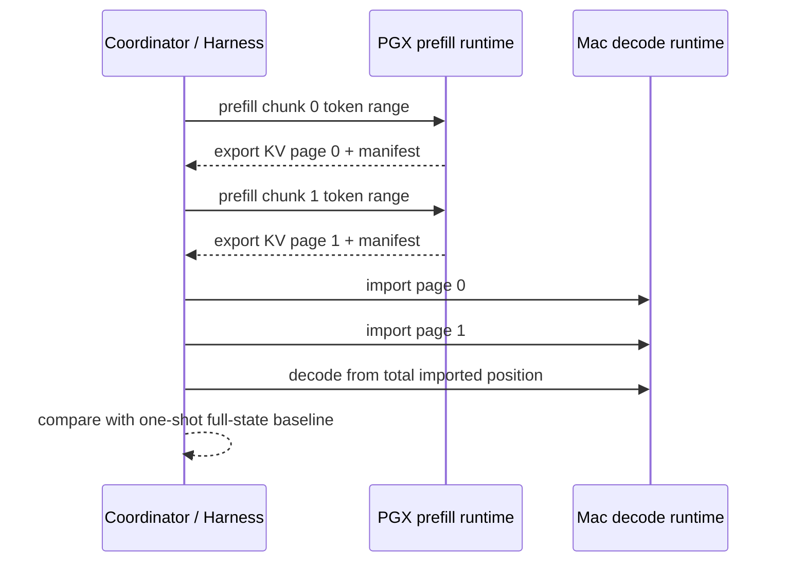

# Design: PD KV Page Handoff Spike

## Current Boundary

The current PD serving path has two separate facts that must not be conflated:

1. The runtime/native layer exposes KV page/range import and export APIs.
2. The deployed PD handoff path still transfers one final full native state
   blob after all chunked prefill work completes.

The first fact suggests streaming KV may be feasible. The second fact means
the current system has not yet proven page-level handoff across PGX CUDA and
Mac Metal.

This spike sits between those facts. It should prove page correctness before
the project attempts overlap, pipelining, or larger context targets.

## Minimal Spike Path

The smallest useful flow is:

The spike may use a temporary harness or local binary-control path. It must
not call full-state export and label the result as page handoff.

## Page Manifest

Each page handoff unit should carry:

- protocol version, for example `pd-kv-page/1`;
- page index;
- total expected pages;
- token start and token end positions;
- layer start and layer end;
- dtype and layout metadata;
- native KV page flags;
- payload byte count;
- checksum algorithm and checksum;
- model artifact identity;
- tokenizer metadata hash;
- chat template hash;
- source and target runtime capability labels;
- decode start position after the final imported page.

The final report should also record the ordered page manifest list and whether
the imported token positions are contiguous.

## Correctness Baseline

The baseline is the existing one-shot full-state handoff path over
large-state framing. The spike should use deterministic settings, preferring
exact token match when token IDs are available.

If heterogeneous backend nondeterminism appears, the report must record a
bounded token-level divergence:

- first divergence token index;
- baseline token id or text fragment when safe and available;
- page-handoff token id or text fragment when safe and available;
- logits/top-k if available;
- whether the result is inconclusive rather than pass.

Subjective "looks close" comparison is not a pass criterion.

## Negative Checks

The spike must fail closed on:

- missing page;
- duplicate page;
- out-of-order page;
- position gap;
- position overlap;
- checksum mismatch;
- dtype/layout mismatch;
- artifact/tokenizer/template mismatch;
- import failure;
- any path that silently falls back to a full-state blob.

Mac must not decode from an ambiguous imported state.

## Telemetry And Report

Required sanitized report fields:

- `result`: `pass`, `fail`, or `inconclusive`;
- `recommendation`: `proceed_to_streaming_handoff`, `redesign`, or
  `run_more_spike`;
- page count;
- page token ranges;
- page bytes;
- page export latency;
- page transfer/read/write latency;
- page import latency;
- decode TTFT after final import;
- one-shot baseline identity;
- correctness comparison;
- bounded failure reason.

Reports must not include prompt text, generated content, complete token
arrays, KV/native payload contents, credentials, private paths, endpoint URLs,
or real machine labels.

## Relationship To Streaming KV Handoff

`pd-streaming-kv-handoff` should depend on this spike outcome. If page export
and ordered import are correct, a later change can add overlap and pipeline
scheduling. If page import cannot append correctly or cannot cross CUDA to
Metal, the streaming design must be redesigned around a different runtime API
or remain on full-state framing.

## No-Go Conditions

The spike should recommend redesign if:

- page import cannot append token ranges into a usable decode state;
- CUDA-exported pages cannot import into the Metal runtime;
- recurrent or non-KV state is required and missing;
- page metadata is insufficient to validate layout and identity;
- the implementation requires full-state export to pass;
- deterministic comparison diverges without a bounded explanation.
