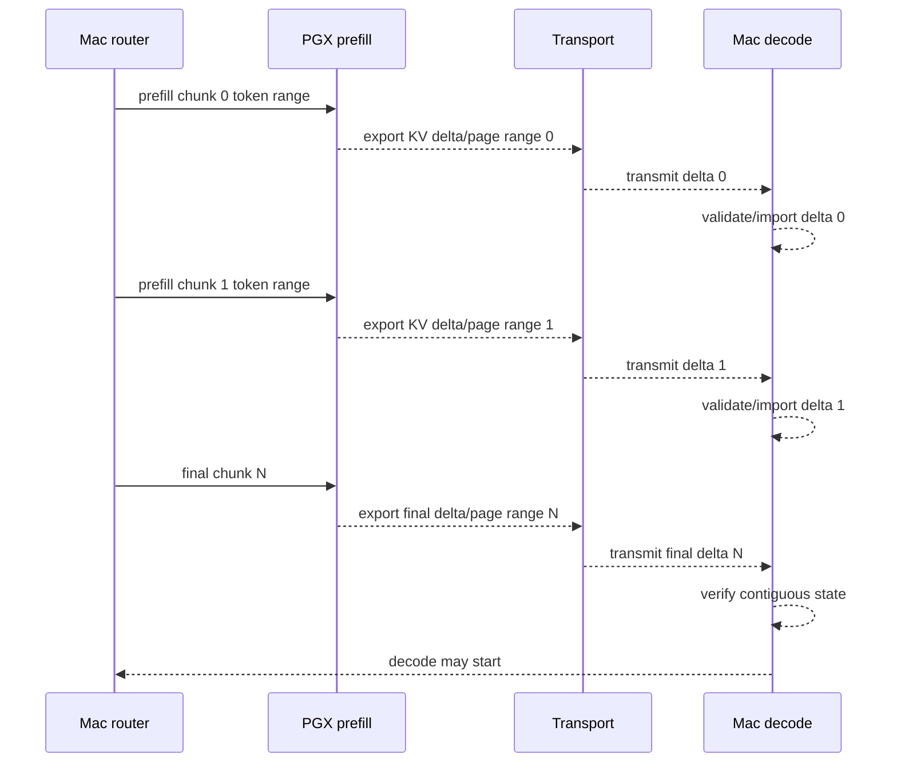

# Design: PD Streaming KV Handoff

## Current Limitation

The current 4k chunked prefill path still performs final native state handoff
as one large transfer:

1. PGX completes all prefill chunks;
2. PGX exports one final native state payload;
3. the payload crosses the network through large-state framing;
4. Mac imports the complete state;
5. decode begins.

This proves correctness for 4k, but it serializes export, network transfer,
and import after prefill. The measured 4k timing shows the transfer path
dominates TTFT.

Evidence paths:

- `openspec/specs/pd-disaggregated-serving-mvp/spec.md`: default-off scoped PD
  serving contract.
- `openspec/specs/pd-chunked-prefill/spec.md`: chunked prefill lifecycle and
  4k validation boundary.
- `openspec/specs/pd-large-state-framing/spec.md`: current large-state frame
  stream fallback/baseline.
- `openspec/changes/archive/2026-05-21-pd-chunked-prefill/reports/`: 4k
  chunked prefill foreground smoke evidence and timing shape.

## Target Pipeline

The target pipeline overlaps prefill, export, transfer, and import without
starting decode until the full prompt state is complete:

The router must treat the whole prefill request as one logical session. Every
delta/page range must advance position monotonically. Mac must not decode from
partially imported or ambiguous state.

## Current Foreground Status

The first PGX/Mac foreground smoke proved the streaming lifecycle correctness
for a small 128-token / 64+64 request:

- PGX exported KV page segments for each chunk;
- Mac imported KV page segments for each chunk;
- chunk `0` import completed before the final contiguous gate and before
  chunk `1` final import;
- final contiguous gate passed;
- trim/replay bootstrap produced logits at decode start position `128`;
- local one-shot prefill/decode baseline was an exact token match;
- no full-state handoff was used as the streaming proof.

That smoke did **not** prove measurable compute/transfer overlap. The live
harness still dispatches and imports serially, so the report records
`overlap_ms=0`. A separate async coordinator phase is required before treating
4k timing as evidence of the intended overlap pipeline.

## Phase 2 Async Coordinator

The next local implementation phase should keep the same `pd-kv-stream/1`
manifest and correctness gates, but decouple source prefill/export from Mac
page import.

Recommended shape:

1. Use a control channel for chunk requests and lifecycle ACKs.
2. Use a page stream channel for manifest + payload frames, or equivalently a
   single connection with explicit request pipelining and a background reader.
3. Let the coordinator dispatch chunk `N+1` once chunk `N` export headers are
   accepted and capacity permits, without waiting for all chunk `N` page
   segments to finish importing.
4. Run Mac page validation/import in an importer task fed by a bounded queue.
5. Keep final decode gated on all chunks being contiguous, checksummed,
   imported, and bootstrap-ready.

The initial async policy should keep `out_of_order_policy=fail_closed`.
Out-of-order arrivals are easier to buffer later, but the first overlap proof
should prefer a narrow invariant: chunk manifests must arrive and be imported
in chunk index order. Segment-level order within a chunk must also remain
strict unless the manifest is extended with explicit segment sequencing.

Capacity controls:

- `max_in_flight_chunks`;
- `max_in_flight_bytes`;
- `max_frame_bytes`;
- bounded page queue length;
- source backpressure when the importer queue is full;
- cancel/timeout cleanup for source session, transport, and importer task.

The async proof is still a correctness harness, not production serving. It
should remain default-off and must not introduce multi-request scheduling.

## Phase 2 Live Harness Shape

The current live harness now exposes an async mode for the test-only
`skippy-correctness kv-streaming-handoff` command. It does not modify the
production binary protocol.

Implemented shape:

1. `source --pipeline-mode async` accepts the coordinator control stream and
   uses the same TCP connection full-duplex.
2. Coordinator-to-source frames carry `prefill_chunk` and `stop` control
   requests.
3. Source-to-coordinator frames carry control ACKs and page frames:
   `prefill_started`, `prefill_completed`, `export_started`,
   `export_completed`, `page`, `chunk_done`, `stopped`, or `error`.
4. The source prefill/export loop enqueues page frames into a bounded writer
   queue. After page frames for chunk `N` are queued, the source can return to
   reading control requests and begin chunk `N+1` without waiting for Mac
   import completion.
5. The coordinator sends chunk requests through a request writer while a
   background reader consumes source frames.
6. A Mac importer worker validates/checksums/imports page frames and commits
   completed chunks through the same final contiguous gate used by the local
   controller.

The first async live harness report is readiness-only:
`reports/async-live-harness-report.{md,json}`. It records `not_run` runtime
export/import and `ready_for_async_foreground_smoke`. It must not be cited as a
foreground overlap pass until a PGX/Mac run has measured overlap or recorded a
bounded no-overlap explanation.

## Phase 3 Split-Channel Telemetry

The 128-token async foreground smoke and 4k async foreground smoke both passed
correctness, but the 4k report showed only tiny measured overlap. The current
async live harness still multiplexes control ACKs and page payload frames on
one full-duplex TCP stream, so large page payload writes can create head-of-line
effects and make control timing hard to interpret.

Phase 3 keeps the same `pd-kv-stream/1` correctness contract and remains a
test-only `skippy-correctness` harness change. It splits the live harness into
two channels:

1. a control channel for `prefill_chunk`, `prefill_started`,
   `prefill_completed`, `export_started`, `export_completed`, `chunk_done`,
   `stop`, and `error`;
2. a page stream channel for page frame headers plus raw page payload bytes.

The source can emit control ACKs without waiting for a large page payload to
finish writing. The page writer still uses a bounded queue and reports
source-side write/backpressure telemetry. The coordinator runs independent
control and page readers, forwards both streams into the importer/final-gate
logic, and keeps the existing fail-closed order policy.

New source-side telemetry:

- source prefill start/end per chunk;
- source export start/end per chunk;
- page write start/end and write/flush duration per segment;
- writer queue send wait;
- source queue depth;
- source backpressure wait;
- control event emit timestamps.

New coordinator telemetry:

- control event receive timestamps;
- control event lag after first-event clock offset alignment;
- page receive start/end;
- import start/end;
- importer idle time and queue depth;
- final gate timing.

Overlap is reported conservatively:

- `true_compute_transfer_overlap_ms`: computed from aligned source-side
  prefill/export windows and coordinator page transfer/import windows when a
  first control-event offset is available;
- `coordinator_observed_overlap_ms`: computed only from coordinator-observed
  timings;
- `source_relative_overlap_ms`: retained as a bounded diagnostic and not used
  as a cross-machine truth unless the clocks are explicitly aligned;
- `clock_alignment_status`: records whether the report used simulated local
  timing, first-event offset alignment, or coordinator-only timing.

The Phase 3 local report is readiness-only:
`reports/split-channel-telemetry-report.{md,json}`. It must not be cited as a
foreground split-channel pass until a PGX/Mac smoke is run.

## Phase 3 Foreground Result And Closure Scope

The 4k split-channel foreground smoke has now passed in the
`skippy-correctness` foreground harness:

- prompt size: `4096` tokens split into four `1024`-token chunks;
- protocol: `pd-kv-stream/1`;
- transport: split control channel plus page stream;
- source path: PGX per-chunk `export_kv_page` observed;
- target path: Mac per-chunk `import_kv_page` observed;
- cache shape: Gemma4 ISWA `base` and `swa` page segments present;
- final gate: pass;
- bootstrap: `trim_replay_last_token` pass with `logits_ready=true`;
- decode start position: `4096`;
- correctness baseline: `local_one_shot_prefill_decode`;
- comparison: `exact_token_match`;
- full-state handoff as streaming proof: no;
- fallback: no.

Timing evidence from the 4k split-channel report:

- split-channel decode-ready: about `43.12s`;
- previous single-stream async 4k decode-ready: about `58.93s`;
- decode-ready improvement: about `15.81s`, or about `26.8%`;
- split-channel overlap: about `23.31s`;
- previous single-stream async overlap: about `0.252ms`;
- total page bytes: `3,690,987,520`;
- bytes per token: `901,120`.

This closes the change as a 4k split-channel streaming KV handoff correctness
and measurable-overlap proof in the `skippy-correctness` foreground harness.
It does not claim production router integration or payload-size reduction.
The summed transfer/export buckets changed shape with the new split-channel
source-side telemetry, so they should not be compared one-for-one with the
single-stream async report. Decode-ready and overlap are the primary timing
comparison signals for this closure.

Deferred/future scope:

- 8k split-channel smoke;
- production PD router/admission integration;
- production timeout/cancel hardening;
- KV compression or lower-precision payload reduction;
- 32k/128k/256k validation;
- multi-worker placement, scheduler behavior, production concurrency, and UI
  work.

## Delta/Page Manifest

Each streamed handoff unit should have a manifest that binds:

- protocol version, for example `pd-kv-stream/1`;
- chunk index;
- total expected chunks and total expected prompt tokens;
- token start position and token end position;
- decode start position after this chunk;
- KV byte range or page ids;
- dtype and layout;
- native page/session identity;
- payload byte count;
- checksum algorithm and checksum;
- model artifact identity;
- tokenizer metadata hash;
- chat template hash;
- large-state framing or transport frame protocol, if reused.

The final request manifest should bind the ordered set of per-chunk manifests
and the final decode start position.

## Ordering And Fail-Closed Semantics

The receiver must fail closed on:

- out-of-order frame or chunk index;
- missing chunk;
- duplicated chunk;
- checksum mismatch;
- total byte mismatch;
- position gap or overlap;
- token range mismatch;
- dtype/layout mismatch;
- artifact/tokenizer/template identity mismatch;
- import failure;
- stream timeout;
- cancel or cleanup failure.

Before assistant content is visible, the router may use the existing
pre-content fallback/rejection policy. After assistant content is visible, it
must not transparently fallback or mix outputs from another path.

## Capacity Gates

Streaming handoff adds queueing and memory pressure. Admission and runtime
capacity checks should include:

- max in-flight KV chunks;
- max queued bytes waiting for network;
- max queued bytes waiting for Mac import;
- max frame bytes;
- max total handoff bytes;
- network timeout per chunk and whole request;
- Mac import timeout per chunk;
- cancel cleanup for PGX, network, and Mac importer.

The first implementation should keep a single request lane and bounded
in-flight chunks. It should not turn this into a production scheduler.

## Telemetry

Required sanitized telemetry:

- `pd.kv_stream.enabled`;
- `pd.kv_stream.protocol`;
- `pd.kv_stream.chunk_count`;
- `pd.kv_stream.chunk_index`;
- `pd.kv_stream.token_start`;
- `pd.kv_stream.token_end`;
- `pd.kv_stream.prefill_ms`;
- `pd.kv_stream.delta_export_ms`;
- `pd.kv_stream.delta_network_ms`;
- `pd.kv_stream.delta_import_ms`;
- `pd.kv_stream.overlap_ms`;
- `pd.kv_stream.pipeline_idle_ms`;
- `pd.kv_stream.source_idle_ms`;
- `pd.kv_stream.importer_idle_ms`;
- `pd.kv_stream.backpressure_wait_ms`;
- `pd.kv_stream.in_flight_bytes`;
- `pd.kv_stream.page_queue_depth`;
- `pd.kv_stream.ttft_ms`;
- `pd.kv_stream.bytes_per_token`;
- `pd.kv_stream.result`;
- bounded failure reason labels.

Telemetry and reports must not include prompt text, complete token arrays,
generated content, KV/native payload contents, credentials, private paths,
endpoint URLs, or real machine labels.

## Correctness Validation

The original proposal kept large-state framing as the known-good fallback and
performance reference. During application, the deterministic foreground
correctness baseline was narrowed to `local_one_shot_prefill_decode`, because
the KV page handoff support changes had already proven page import/decode
correctness against that local one-shot baseline and the streaming harness must
not reuse full-state handoff as its pass path. Streaming handoff should be
compared against deterministic baseline requests:

- short prompt to prove non-chunked behavior stays clean;
- 4k prompt as the first streaming handoff target;
- optional 8k only after 4k passes;
- fixed sampling controls where supported;
- token/position continuity assertions;
- output comparison against deterministic one-shot local decode using existing
  bounded comparison rules.

If backend differences make exact output comparison unavailable, the report
must record first divergence token or equivalent bounded metadata when
available. It must not accept "looks close" as pass.

## Runtime Capability Unknowns

This change should be spike-first because several required capabilities may
not exist yet:

- PGX native runtime may only export full state, not per-chunk delta or page
  ranges;
- Mac native runtime may only import a full state snapshot, not append chunks;
- native KV page ids and layout may not be stable across chunk boundaries;
- imported chunk order may require runtime session APIs that do not exist;
- checksum/manifest binding may need new transport metadata;
- overlap may be limited if export/import APIs are blocking and hold global
  runtime locks.

If delta export/import is unavailable, the correct next step is a smaller
runtime API spike rather than forcing streaming semantics on full-state
framing.

## Fallback And Baseline

Large-state framing remains the known-good fallback/reference path from the
earlier PD work, but it is not used as the pass condition for the streaming KV
harness. Streaming KV handoff must be explicitly capability-gated and
default-off. If a peer lacks `pd-kv-stream/1` or validation fails, future
production integration must fail closed or fall back before visible assistant
content according to existing PD policy.
